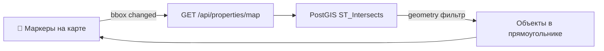
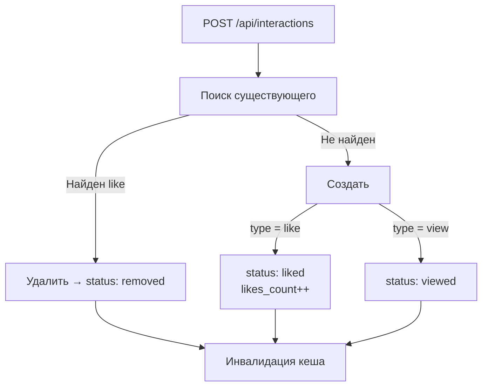
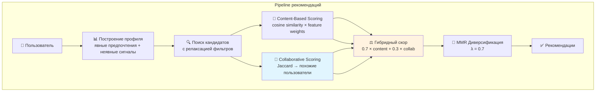
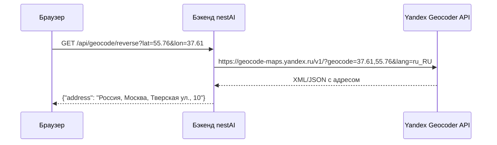

# API Reference

**Базовый URL:** `http://localhost:8000`

Все эндпоинты, требующие аутентификации, используют **Bearer token** в заголовке `Authorization`:

```
Authorization: Bearer <access_token>
```

## Содержание

- [Аутентификация (Auth)](#auth)
  - [Регистрация](#register)
  - [Вход](#login)
  - [Обновление токена](#refresh-token)
  - [Текущий пользователь](#get-current-user)
  - [Обновление профиля](#update-current-user)
- [Объекты недвижимости (Properties)](#properties)
  - [Метаданные](#get-property-meta)
  - [Список](#list-properties)
  - [Мои объекты](#get-my-properties)
  - [В bounding box](#get-properties-in-bounding-box)
  - [Детали](#get-property-details)
  - [Создание](#create-property)
  - [Обновление](#update-property)
  - [Удаление](#delete-property)
- [Предпочтения (User Preferences)](#user-preferences)
  - [Получить](#get-preferences)
  - [Обновить](#update-preferences)
- [Взаимодействия (Interactions)](#interactions)
  - [Лайк/Просмотр](#interact-with-property)
  - [Избранное](#get-favorites)
  - [История просмотров](#get-view-history)
- [Рекомендации (Recommendations)](#recommendations)
  - [Получить](#get-recommendations)
- [Изображения (Images)](#images)
  - [Загрузить](#upload-images)
  - [Получить](#get-image)
  - [Удалить](#delete-image)
- [Геокодирование (Geocoding)](#geocoding)
  - [Обратное геокодирование](#reverse-geocode)

---

## Аутентификация (Auth)

### Регистрация

Создаёт новый аккаунт пользователя.

```
POST /auth/register
```

**Аутентификация:** Не требуется

**Тело запроса:**

```json
{
  "email": "user@example.com",
  "password": "SecurePass1!",
  "full_name": "Иван Иванов",
  "phone_number": "+79991234567",
  "telegram_handle": "@ivanov"
}
```

**Схема:**

| Поле | Тип | Обязательное | Описание |
|---|---|---|---|
| `email` | string (email) | Да | Должен быть валидным email |
| `password` | string | Да | Мин. 8 символов, заглавная, строчная, цифра |
| `full_name` | string | Да | Отображаемое имя |
| `phone_number` | string | Нет | Виден владельцам объектов при бронировании |
| `telegram_handle` | string | Нет | Виден владельцам объектов |

**Успешный ответ (201 Created):**

```json
{
  "id": "550e8400-e29b-41d4-a716-446655440000",
  "email": "user@example.com",
  "full_name": "Иван Иванов",
  "phone_number": "+79991234567",
  "telegram_handle": "@ivanov"
}
```

**Ошибки:**

| Статус | Описание |
|---|---|
| `400` | Email уже существует или пароль не прошёл валидацию |

---

### Вход

Аутентификация пользователя, возвращает JWT access token.

```
POST /auth/login
```

**Аутентификация:** Не требуется

**Тело запроса:**

```json
{
  "email": "user@example.com",
  "password": "SecurePass1!"
}
```

**Успешный ответ (200 OK):**

```json
{
  "access_token": "eyJhbGciOiJIUzI1NiIs...",
  "token_type": "bearer"
}
```

**Ошибки:**

| Статус | Описание |
|---|---|
| `401` | Неверный email или пароль |

---

### Обновление токена

Выдаёт новый access token из существующего (в том числе недавно истёкшего).

```
POST /auth/refresh
```

**Аутентификация:** Bearer token

**Успешный ответ (200 OK):**

```json
{
  "access_token": "eyJhbGciOiJIUzI1NiIs...",
  "token_type": "bearer"
}
```

**Ошибки:**

| Статус | Описание |
|---|---|
| `401` | Токен невалидный или истёк слишком давно |

---

### Текущий пользователь

Возвращает профиль аутентифицированного пользователя.

```
GET /auth/me
```

**Аутентификация:** Bearer token

**Успешный ответ (200 OK):**

```json
{
  "id": "550e8400-e29b-41d4-a716-446655440000",
  "email": "user@example.com",
  "full_name": "Иван Иванов",
  "phone_number": "+79991234567",
  "telegram_handle": "@ivanov"
}
```

**Ошибки:**

| Статус | Описание |
|---|---|
| `401` | Невалидный или отсутствующий токен |

---

### Обновление профиля

Обновляет профиль аутентифицированного пользователя.

```
PUT /auth/me
```

**Аутентификация:** Bearer token

**Тело запроса:**

```json
{
  "full_name": "Пётр Петров",
  "phone_number": "+79997654321",
  "telegram_handle": "@petrov"
}
```

**Схема:**

| Поле | Тип | Обязательное | Описание |
|---|---|---|---|
| `full_name` | string | Нет | Новое имя |
| `phone_number` | string | Нет | Новый телефон |
| `telegram_handle` | string | Нет | Новый Telegram |

Все поля опциональны — обновляются только переданные.

**Важно:** Если у пользователя есть активные объявления, нельзя очистить одновременно `phone_number` и `telegram_handle`. Хотя бы один контакт должен остаться.

**Успешный ответ (200 OK):**

```json
{
  "id": "550e8400-e29b-41d4-a716-446655440000",
  "email": "user@example.com",
  "full_name": "Пётр Петров",
  "phone_number": "+79997654321",
  "telegram_handle": "@petrov"
}
```

**Ошибки:**

| Статус | Описание |
|---|---|
| `400` | Нельзя очистить все контакты при активных объявлениях |
| `401` | Невалидный токен |

---

## Объекты недвижимости (Properties)

### Метаданные

Возвращает уникальные значения для выпадающих фильтров (города, типы, материалы, типы ремонта и т.д.).

```
GET /api/properties/meta
```

**Аутентификация:** Не требуется

**Успешный ответ (200 OK):**

```json
{
  "cities": ["Moscow", "Saint Petersburg", "Kazan"],
  "property_types": ["apartment", "house", "studio", "townhouse"],
  "property_purposes": ["sale", "rent", "daily_rent"],
  "materials": ["panel", "brick", "monolith"],
  "repair_types": ["cosmetic", "euro", "designer"],
  "districts": ["Central", "Northern", "Southern"],
  "metro": ["Park Pobedy", "Kiyevskaya", "Mayakovskaya"],
  "city_centers": {
    "Moscow": [37.6173, 55.7558],
    "Saint Petersburg": [30.3158, 59.9390]
  }
}
```

---

### Список объектов

Возвращает пагинированный список объектов недвижимости с фильтрацией.

```
GET /api/properties/?limit=20&offset=0&city=Moscow&min_price=5000000&max_price=15000000&rooms=1,2&property_purpose=sale&search=центр
```

**Аутентификация:** Опционально — если аутентифицирован, результаты содержат `is_liked_by_me`.

**Параметры запроса:**

| Параметр | Тип | По умолч. | Макс. | Описание |
|---|---|---|---|---|
| `limit` | integer | 100 | 200 | Количество результатов |
| `offset` | integer | 0 | — | Смещение пагинации |
| `min_price` | float | — | — | Мин. цена |
| `max_price` | float | — | — | Макс. цена |
| `rooms` | integer[] | — | — | Комнаты через запятую (`1,2`) |
| `property_type` | string[] | — | — | `apartment`, `studio`, `house`, `townhouse` |
| `property_purpose` | string[] | — | — | `sale`, `rent`, `daily_rent` |
| `city` | string[] | — | — | Города через запятую |
| `district` | string | — | — | Район |
| `metro` | string | — | — | Станция метро |
| `material` | string[] | — | — | `panel`, `brick`, `monolith` |
| `repair_type` | string[] | — | — | `cosmetic`, `euro`, `designer` |
| `min_build_year` | integer | — | — | Мин. год постройки |
| `max_build_year` | integer | — | — | Макс. год постройки |
| `min_area` | float | — | — | Мин. площадь (м²) |
| `max_area` | float | — | — | Макс. площадь (м²) |
| `lat` | float | — | — | Широта для пространственного поиска |
| `lon` | float | — | — | Долгота для пространственного поиска |
| `radius_km` | float | — | — | Радиус в км (требует lat+lon) |
| `is_new` | string[] | — | — | `yes`, `no` |
| `search` | string | — | — | Полнотекстовый поиск по названию, описанию, адресу |

Все текстовые фильтры **регистронезависимые** (используется `LOWER()` в SQL).

**Успешный ответ (200 OK):**

```json
[
  {
    "id": "550e8400-e29b-41d4-a716-446655440001",
    "title": "2-комнатная квартира в центре",
    "description": "Светлая квартира с панорамным видом...",
    "price": 12000000,
    "area": 65.5,
    "rooms": 2,
    "floor": 7,
    "total_floors": 16,
    "property_type": "apartment",
    "property_purpose": "sale",
    "city": "Moscow",
    "address": "ул. Тверская, 10",
    "district": "Central",
    "metro": "Tverskaya",
    "lat": 55.7658,
    "lon": 37.6065,
    "images": ["http://localhost:8000/api/images/prop_001.jpg"],
    "build_year": 2020,
    "material": "brick",
    "repair_type": "euro",
    "room_type": "separate",
    "balcony": true,
    "parking": false,
    "is_new": false,
    "sq_living": 45.0,
    "sq_kitchen": 12.0,
    "views_count": 150,
    "likes_count": 12,
    "is_liked_by_me": false,
    "owner": {
      "id": "550e8400-e29b-41d4-a716-446655440000",
      "full_name": "Иван Иванов",
      "phone_number": "+79991234567",
      "telegram_handle": "@ivanov"
    },
    "created_at": "2025-01-15T10:30:00Z"
  }
]
```

**Схема PropertyOut:**

| Поле | Тип | Описание |
|---|---|---|
| `id` | UUID | ID объекта |
| `title` | string | Название |
| `description` | string | Описание |
| `price` | number | Цена |
| `area` | number | Площадь (м²) |
| `rooms` | integer | Комнаты |
| `floor` / `total_floors` | integer | Этаж / Всего этажей |
| `property_type` | string | Тип: apartment, studio, house, townhouse |
| `property_purpose` | string | Цель: sale, rent, daily_rent |
| `category` | string | Категория (вычисляется) |
| `city` | string | Город |
| `address` | string | Адрес |
| `district` / `metro` | string | Район / Метро |
| `lat` / `lon` | number | Координаты (из PostGIS geometry) |
| `images` | string[] | URL изображений |
| `build_year` | string | Год постройки |
| `material` | string | Материал стен |
| `repair_type` | string | Тип ремонта |
| `room_type` | string | Тип комнат: separate, open |
| `sq_living` / `sq_kitchen` | number | Жилая / Кухня (м²) |
| `balcony` / `parking` | boolean | Балкон / Парковка |
| `is_new` | string | Новостройка: yes/no |
| `views_count` | integer | Количество просмотров |
| `likes_count` | integer | Количество лайков |
| `is_liked_by_me` | boolean | Лайкнул ли текущий пользователь |
| `owner` | OwnerOut | Информация о владельце |
| `created_at` | datetime | Дата создания |

**Схема OwnerOut:**

| Поле | Тип | Описание |
|---|---|---|
| `id` | UUID | ID владельца |
| `full_name` | string | Имя владельца |
| `phone_number` | string | Телефон (PII — только для авторизованных) |
| `telegram_handle` | string | Telegram (PII) |

---

### Мои объекты

Возвращает объекты, созданные аутентифицированным пользователем.

```
GET /api/properties/my?limit=20&offset=0
```

**Аутентификация:** Bearer token (обязательно)

**Параметры запроса:**

| Параметр | Тип | По умолч. | Макс. | Описание |
|---|---|---|---|---|
| `limit` | integer | 100 | 200 | Количество результатов |
| `offset` | integer | 0 | — | Смещение (мин. 0) |

**Успешный ответ (200 OK):**

Та же схема, что и [Список объектов](#list-properties).

---

### Объекты в bounding box

Возвращает объекты в заданном географическом прямоугольнике для отображения на карте.

```
GET /api/properties/map?min_lat=55.6&max_lat=55.8&min_lon=37.4&max_lon=37.7
```

**Аутентификация:** Опционально — `is_liked_by_me` если аутентифицирован.

**Параметры запроса:**

| Параметр | Тип | Обязательный | Описание |
|---|---|---|---|
| `min_lat` | float | **Да** | Южная широта |
| `max_lat` | float | **Да** | Северная широта |
| `min_lon` | float | **Да** | Западная долгота |
| `max_lon` | float | **Да** | Восточная долгота |
| `limit` | integer | Нет | По умолч. 50, макс. 200 |
| `offset` | integer | Нет | По умолч. 0 |
| `min_price`, `max_price` | float | Нет | Диапазон цен |
| `rooms` | integer[] | Нет | Комнаты |
| `property_type` | string[] | Нет | Типы |
| `property_purpose` | string[] | Нет | Цели |
| `city` | string[] | Нет | Города |
| `min_area`, `max_area` | float | Нет | Площадь |
| `material` | string[] | Нет | Материалы |
| `repair_type` | string[] | Нет | Ремонт |
| `is_new` | string[] | Нет | Новостройка |

Использует PostGIS `ST_MakeEnvelope` + `ST_Intersects` для эффективных пространственных запросов.

**Успешный ответ (200 OK):**

Та же схема, что и [Список объектов](#list-properties).



---

### Детали объекта

Возвращает один объект по ID.

```
GET /api/properties/{property_id}
```

**Параметры пути:**

| Параметр | Тип | Описание |
|---|---|---|
| `property_id` | UUID | ID объекта |

**Аутентификация:** Опционально.

**Успешный ответ (200 OK):**

Та же схема, что и [Список объектов](#list-properties).

**Ошибки:**

| Статус | Описание |
|---|---|
| `404` | Объект не найден |

---

### Создание объекта

Создаёт новый объект недвижимости.

```
POST /api/properties/
```

**Аутентификация:** Bearer token (обязательно)

**Тело запроса:**

```json
{
  "title": "2-комнатная квартира в центре",
  "price": 12000000,
  "address": "ул. Тверская, 10, Москва",
  "lat": 55.7658,
  "lon": 37.6065,
  "description": "Светлая квартира с панорамным видом",
  "city": "Moscow",
  "rooms": 2,
  "area": 65.5,
  "floor": 7,
  "total_floors": 16,
  "property_type": "apartment",
  "property_purpose": "sale",
  "district": "Central",
  "metro": "Tverskaya",
  "images": ["http://localhost:8000/api/images/prop_001.jpg"],
  "build_year": 2020,
  "material": "brick",
  "repair_type": "euro",
  "room_type": "separate",
  "sq_living": 45.0,
  "sq_kitchen": 12.0,
  "balcony": true,
  "parking": false,
  "is_new": false
}
```

**Обязательные поля:** `title`, `price`, `address`, `lat`, `lon`

Если координаты не указаны, но указан `address`, бэкенд попытается определить их через Yandex Geocoder API.

**Успешный ответ (201 Created):**

Та же схема, что и [Список объектов](#list-properties).

**Ошибки:**

| Статус | Описание |
|---|---|
| `400` | Невалидные координаты (lat: -90..90, lon: -180..180) |
| `401` | Отсутствует или невалидный токен |

---

### Обновление объекта

Обновляет существующий объект. Только владелец может обновлять.

```
PUT /api/properties/{property_id}
```

**Параметры пути:**

| Параметр | Тип | Описание |
|---|---|---|
| `property_id` | UUID | ID объекта |

**Аутентификация:** Bearer token (проверка владельца)

**Тело запроса:**

```json
{
  "price": 13000000,
  "description": "Обновлённое описание"
}
```

Все поля из [Создания](#create-property) опциональны.

**Успешный ответ (200 OK):**

Та же схема, что и [Список объектов](#list-properties).

**Ошибки:**

| Статус | Описание |
|---|---|
| `400` | Нет полей для обновления |
| `403` | Не владелец объекта |
| `404` | Объект не найден |

---

### Удаление объекта

Удаляет объект недвижимости. Только владелец может удалять.

```
DELETE /api/properties/{property_id}
```

**Параметры пути:**

| Параметр | Тип | Описание |
|---|---|---|
| `property_id` | UUID | ID объекта |

**Аутентификация:** Bearer token (проверка владельца)

**Успешный ответ (204 No Content):**

Без тела ответа.

**Ошибки:**

| Статус | Описание |
|---|---|
| `403` | Не владелец |
| `404` | Объект не найден |

---

## Предпочтения (User Preferences)

### Получить предпочтения

Возвращает поисковые предпочтения аутентифицированного пользователя.

```
GET /user/preferences
```

**Аутентификация:** Bearer token (обязательно)

**Успешный ответ (200 OK):**

```json
{
  "user_id": "550e8400-e29b-41d4-a716-446655440000",
  "min_price": 5000000,
  "max_price": 15000000,
  "min_area": 40.0,
  "max_area": 100.0,
  "preferred_rooms": [1, 2, 3],
  "property_types": ["apartment"],
  "property_purposes": ["sale"],
  "cities": ["Moscow"],
  "material": ["brick"],
  "repair_type": ["euro"],
  "min_build_year": 2010,
  "max_build_year": 2025
}
```

**Ошибки:**

| Статус | Описание |
|---|---|
| `404` | Предпочтения не заданы (новый пользователь) |

---

### Обновить предпочтения

Устанавливает или обновляет поисковые предпочтения (upsert — создаёт если нет, обновляет если есть).

```
PUT /user/preferences
```

**Аутентификация:** Bearer token (обязательно)

**Тело запроса:**

```json
{
  "min_price": 5000000,
  "max_price": 15000000,
  "preferred_rooms": [1, 2],
  "property_types": ["apartment", "studio"],
  "property_purposes": ["sale"],
  "cities": ["Moscow"],
  "min_area": 30.0,
  "max_area": 100.0,
  "material": ["brick", "monolith"],
  "repair_type": ["euro"],
  "min_build_year": 2000,
  "max_build_year": 2025
}
```

Все поля опциональны.

**Успешный ответ (200 OK):**

Та же схема, что и [Get Preferences](#get-preferences).

---

## Взаимодействия (Interactions)

### Лайк / Просмотр

Записывает взаимодействие `like` или `view` с объектом. Лайки работают как **переключатель** — повторный лайк убирает его.

```
POST /api/interactions/interact
```

**Аутентификация:** Bearer token (обязательно)

**Тело запроса:**

```json
{
  "property_id": "550e8400-e29b-41d4-a716-446655440001",
  "interaction_type": "like"
}
```

**Схема:**

| Поле | Тип | Описание |
|---|---|---|
| `property_id` | UUID | ID объекта |
| `interaction_type` | string | `like` или `view` |

**Успешные ответы:**

| Статус | Тело | Сценарий |
|---|---|---|
| `201 Created` | `{"status": "liked"}` | Новый лайк |
| `201 Created` | `{"status": "viewed"}` | Новый просмотр |
| `200 OK` | `{"status": "removed"}` | Лайк убран (toggle) |



**Ошибки:**

| Статус | Описание |
|---|---|
| `404` | Объект не найден |
| `401` | Невалидный токен |

---

### Избранное

Возвращает объекты, лайкнутые аутентифицированным пользователем.

```
GET /api/interactions/favorites?limit=20&offset=0
```

**Аутентификация:** Bearer token (обязательно)

**Успешный ответ (200 OK):**

Та же схема, что и [Список объектов](#list-properties), с `is_liked_by_me: true` для всех.

---

### История просмотров

Возвращает объекты, просмотренные аутентифицированным пользователем. Каждый объект показывается один раз (по последнему просмотру).

```
GET /api/interactions/history?limit=20&offset=0
```

**Аутентификация:** Bearer token (обязательно)

**Успешный ответ (200 OK):**

Та же схема, что и [Список объектов](#list-properties), с `is_liked_by_me` для каждого.

---

## Рекомендации (Recommendations)

### Получить рекомендации

Возвращает персонализированные рекомендации объектов недвижимости с использованием гибридного алгоритма (content-based + collaborative filtering).

```
GET /api/recommendations/?limit=10
```

**Аутентификация:** Bearer token (обязательно)

**Параметры запроса:**

| Параметр | Тип | По умолч. | Макс. | Описание |
|---|---|---|---|---|
| `limit` | integer | 10 | 100 | Количество рекомендаций |

**Алгоритм:**



**Детальный пайплайн:**

1. **Построение профиля пользователя** (14-мерный вектор):
   - Явные предпочтения: цена, комнаты, тип, город из `UserPreferences` (вес 0.6)
   - Неявные сигналы: среднее по лайкам (вес 1.0) и просмотрам (вес 0.2) (вес 0.4)
   - Кешируется в Redis на 1 час

2. **Поиск кандидатов** с прогрессивной релаксацией:
   - Строгие фильтры: город, цель, цена
   - Если мало → убрать материал/ремонт
   - Если всё ещё мало → убрать комнаты/площадь/год
   - Если всё ещё мало → убрать тип недвижимости

3. **Content-Based Scoring:**
   - Нормализация через `StandardScaler`
   - Feature-weighted cosine similarity (веса: price×2, area×1.5, rooms×1.5, city×2)

4. **Collaborative Filtering:**
   - Jaccard similarity на множествах лайков
   - Top-10 похожих пользователей
   - Агрегация их лайков среди кандидатов
   - Нормализация в [0, 1]
   - Активен только если у пользователя ≥ 3 лайков

5. **Гибридный скор:**
   ```
   hybrid[i] = 0.7 × content_score[i] + 0.3 × collab_score[i]
   ```
   Если collab_score[i] отсутствует → `0.7 × content_score[i]`

6. **MMR Диверсификация** (λ = 0.7):
   - Баланс между релевантностью и разнообразием
   - ```
     MMR = λ × relevance - (1 - λ) × max_similarity_to_selected
     ```

7. **Кеширование:**
   - Redis `user_recs:{user_id}:{limit}` TTL 1 час
   - Инвалидация при новом взаимодействии или обновлении предпочтений

8. **Обогащение:**
   - Статус лайка (`is_liked_by_me`)
   - Информация о владельце
   - Количество объявлений владельца

**Успешный ответ (200 OK):**

Та же схема, что и [Список объектов](#list-properties).

**Примечания:**
- **Cold start**: новые пользователи без предпочтений и взаимодействий получают рекомендации без персонализации
- Все ранее просмотренные или лайкнутые объекты исключаются из выдачи

**Ошибки:**

| Статус | Описание |
|---|---|
| `401` | Отсутствует или невалидный токен |

---

## Изображения (Images)

### Загрузить изображения

Загружает изображения в MinIO хранилище.

```
POST /api/upload/
```

**Аутентификация:** Bearer token (обязательно)

**Запрос:** `multipart/form-data`

| Поле | Тип | Описание |
|---|---|---|
| `files` | UploadFile[] | 1–10 файлов |

**Допустимые форматы:** `jpg`, `jpeg`, `png`, `webp`

**Лимиты:**
- Макс. размер: 10 MB на файл
- Макс. количество: 10 файлов за запрос

**Успешный ответ (200 OK):**

```json
{
  "urls": [
    "http://localhost:8000/api/images/uuid_image_001.jpg",
    "http://localhost:8000/api/images/uuid_image_002.jpg"
  ],
  "count": 2
}
```

**Ошибки:**

| Статус | Описание |
|---|---|
| `400` | Неверный формат, файл слишком большой или слишком много файлов |
| `500` | Ошибка MinIO |

---

### Получить изображение

Отдаёт изображение из MinIO.

```
GET /api/images/{filename}
```

**Аутентификация:** Не требуется

**Параметры пути:**

| Параметр | Тип | Описание |
|---|---|---|
| `filename` | string | Имя файла |

**Успешный ответ (200 OK):**

Бинарные данные изображения с `Content-Type`: `image/jpeg`, `image/png` или `image/webp`.

**Ошибки:**

| Статус | Описание |
|---|---|
| `400` | Неверное имя файла |
| `404` | Изображение не найдено |
| `500` | Ошибка сервера |

---

### Удалить изображение

Удаляет изображение из MinIO. Изображение должно принадлежать объекту текущего пользователя.

```
DELETE /api/images/{filename}
```

**Аутентификация:** Bearer token (обязательно)

**Параметры пути:**

| Параметр | Тип | Описание |
|---|---|---|
| `filename` | string | Имя файла |

**Успешный ответ (204 No Content):**

Без тела ответа.

**Ошибки:**

| Статус | Описание |
|---|---|
| `400` | Неверное имя файла |
| `403` | Изображение принадлежит другому пользователю |
| `500` | Ошибка удаления |

---

## Геокодирование (Geocoding)

### Обратное геокодирование

Преобразует координаты в человекочитаемый адрес через Yandex Geocoder API.

```
GET /api/geocode/reverse?lat=55.7558&lon=37.6173
```

**Аутентификация:** Не требуется

**Параметры запроса:**

| Параметр | Тип | Обязательный | Описание |
|---|---|---|---|
| `lat` | float | **Да** | Широта |
| `lon` | float | **Да** | Долгота |

**Успешный ответ (200 OK):**

```json
{
  "address": "Russia, Moscow, Tverskaya Street, 10"
}
```



**Ошибки:**

| Статус | Описание |
|---|---|
| `404` | Адрес не найден для данных координат |
| `500` | API-ключ Yandex не настроен или ошибка внешнего API |

---

## Общий формат ошибок

Все ошибки возвращают:

```json
{
  "detail": "Описание ошибки"
}
```

Ошибки валидации (422):

```json
{
  "detail": [
    {
      "loc": ["body", "price"],
      "msg": "Input should be a valid number",
      "type": "float_parsing"
    }
  ]
}
```

## Сводная таблица эндпоинтов

| Метод | Путь | Auth | Описание |
|---|---|---|---|
| `GET` | `/` | Нет | Приветственное сообщение |
| `POST` | `/auth/register` | Нет | Регистрация |
| `POST` | `/auth/login` | Нет | Вход |
| `POST` | `/auth/refresh` | Bearer | Обновление токена |
| `GET` | `/auth/me` | Bearer | Текущий пользователь |
| `PUT` | `/auth/me` | Bearer | Обновление профиля |
| `GET` | `/api/properties/meta` | Нет | Метаданные фильтров |
| `GET` | `/api/properties/map` | Optional | Объекты в bbox |
| `GET` | `/api/properties/` | Optional | Список объектов |
| `GET` | `/api/properties/my` | Bearer | Мои объекты |
| `GET` | `/api/properties/{id}` | Optional | Детали объекта |
| `POST` | `/api/properties/` | Bearer | Создать объект |
| `PUT` | `/api/properties/{id}` | Bearer | Обновить объект |
| `DELETE` | `/api/properties/{id}` | Bearer | Удалить объект |
| `GET` | `/user/preferences` | Bearer | Получить предпочтения |
| `PUT` | `/user/preferences` | Bearer | Обновить предпочтения |
| `POST` | `/api/interactions/interact` | Bearer | Лайк/Просмотр |
| `GET` | `/api/interactions/favorites` | Bearer | Избранное |
| `GET` | `/api/interactions/history` | Bearer | История просмотров |
| `GET` | `/api/recommendations/` | Bearer | **Рекомендации** |
| `POST` | `/api/upload/` | Bearer | Загрузить изображения |
| `GET` | `/api/images/{filename}` | Нет | Получить изображение |
| `DELETE` | `/api/images/{filename}` | Bearer | Удалить изображение |
| `GET` | `/api/geocode/reverse` | Нет | Обратное геокодирование |
