# Архитектура nestAI

## Общий обзор

nestAI — полноценная full-stack система рекомендации недвижимости с **трёхслойным бэкендом** (API → Service → Repository), **FSD-фронтендом** и **гибридным рекомендательным движком**, сочетающим контентную и коллаборативную фильтрацию.

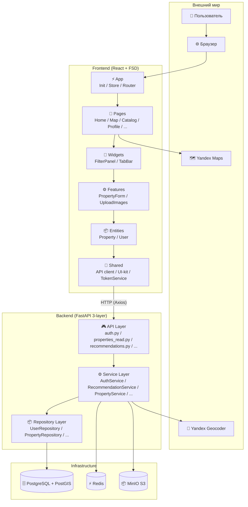

---

## 1. Бэкенд: Трёхслойная архитектура

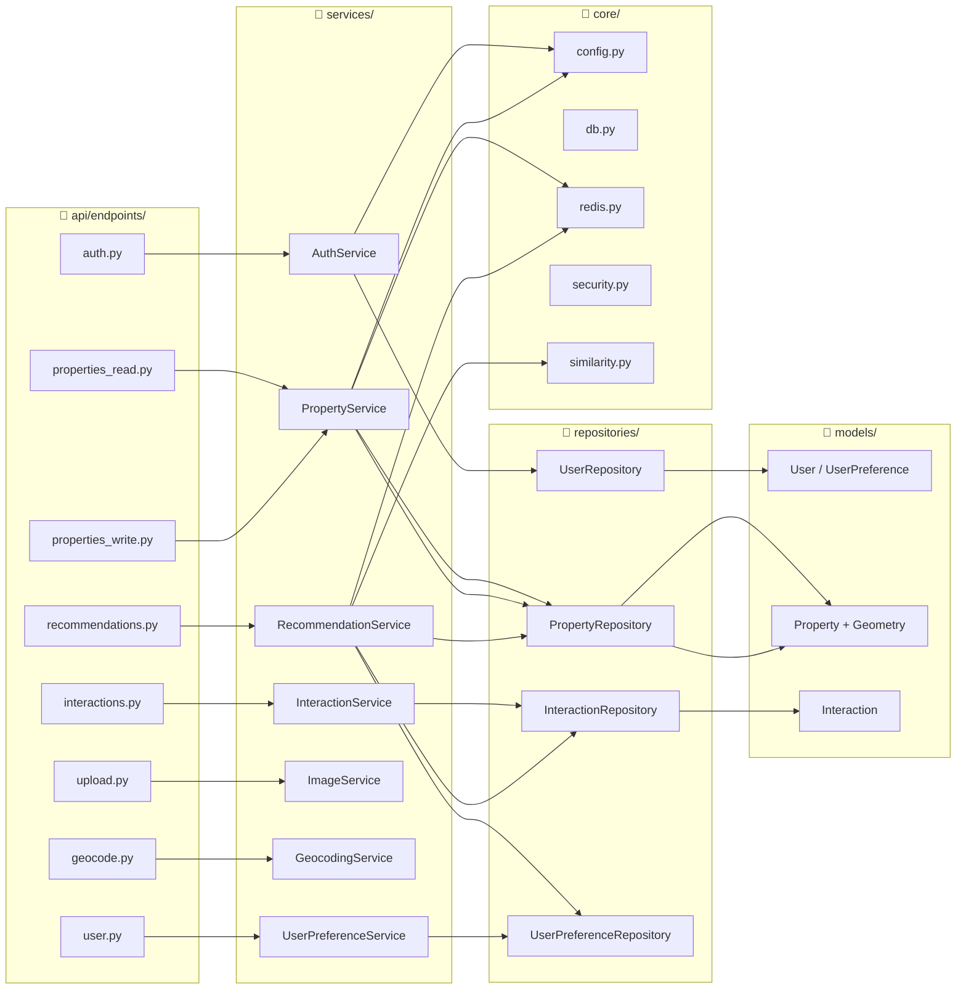

### 1.1 Уровни

| Уровень | Ответственность | Пример |
|---|---|---|
| **API Layer** | HTTP-маршрутизация, аутентификация, валидация запросов, форматирование ответов | `properties_read.py` валидирует query-параметры, вызывает сервис, возвращает JSON |
| **Service Layer** | Бизнес-логика, оркестрация, кеширование | `RecommendationService` строит вектор пользователя, вычисляет скоринг, применяет MMR |
| **Repository Layer** | SQL-запросы, JOIN, агрегации | `PropertyRepository.get_all()` динамически строит WHERE из 15+ фильтров |

### 1.2 Сервисы

| Сервис | Файл | Обязанности | Зависимости |
|---|---|---|---|
| **AuthService** | `auth_service.py` | Регистрация (валидация пароля, bcrypt хеширование), JWT create/refresh, обновление профиля (с защитой контактов при активных объявлениях) | `UserRepository` |
| **PropertyService** | `property_service.py` | CRUD, геокодирование при создании, обогащение (владелец, лайки, координаты), кеширование в Redis | `PropertyRepository`, `UserRepository`, `GeocodingService`, `RedisClient` |
| **InteractionService** | `interactions_service.py` | Добавление/удаление лайков (toggle), запись просмотров, синхронизация счётчиков, инвалидация кеша | `InteractionRepository`, `PropertyRepository`, `RedisClient` |
| **UserPreferenceService** | `preferences_service.py` | Получение и обновление предпочтений пользователя (upsert) | `UserPreferenceRepository` |
| **RecommendationService** | `recommendation_service.py` | **Гибридный ML-движок** — см. раздел 4 | `PropertyRepository`, `UserPreferenceRepository`, `InteractionRepository`, `RedisClient`, `SimilarityUtils` |
| **ImageService** | `image_service.py` | Загрузка/удаление/отдача изображений, управление bucket, валидация файлов (тип, размер, количество) | `MinioClient` |
| **GeocodingService** | `geocoding_service.py` | Прямое и обратное геокодирование через Yandex Geocoder API | `httpx` |

### 1.3 Репозитории

| Репозиторий | Ключевые методы | Особенности SQL |
|---|---|---|
| **PropertyRepository** | `get_all` (15+ фильтров, spatial radius), `get_by_bbox` (PostGIS), `get_meta` (distinct values), `get_by_ids` (bulk), `get_by_image_url` | `ST_MakeEnvelope` / `ST_Intersects`, case-insensitive фильтры, динамическая сборка WHERE, пагинация |
| **UserRepository** | `get_by_email`, `get_by_id`, `get_by_ids`, `create`, `update` | — |
| **InteractionRepository** | `create_interaction`, `find_interaction`, `get_user_favorites` (JOIN), `get_user_view_history` (subquery с max per property), `batch_check_likes`, `get_users_liked_properties` (collaborative), `remove_interaction` | Сложные JOIN, подзапросы, агрегация |
| **UserPreferenceRepository** | `get_by_user_id`, `update_or_create` | `INSERT ... ON CONFLICT DO UPDATE` (upsert) |

### 1.4 DI и жизненный цикл

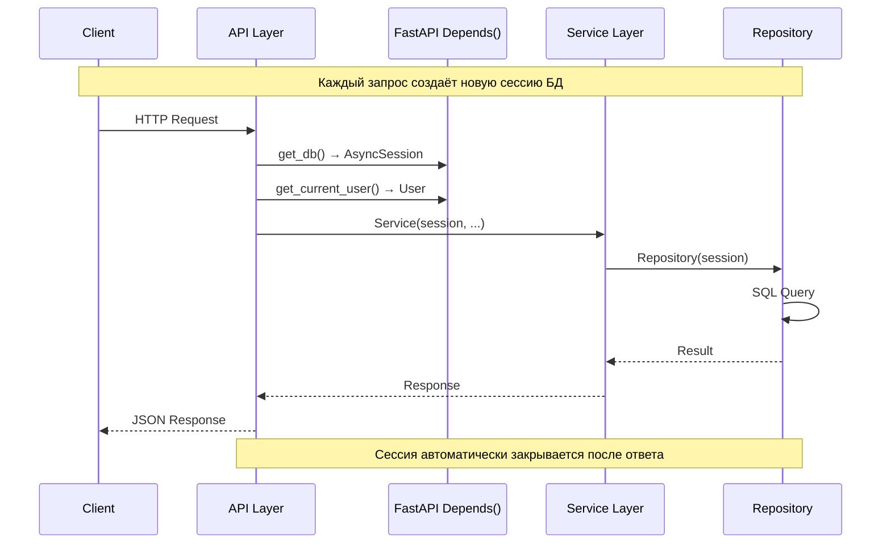

---

## 2. Фронтенд: Feature-Sliced Design (FSD)

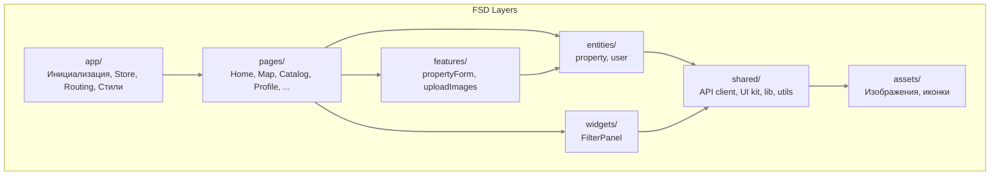

### 2.1 Роутинг

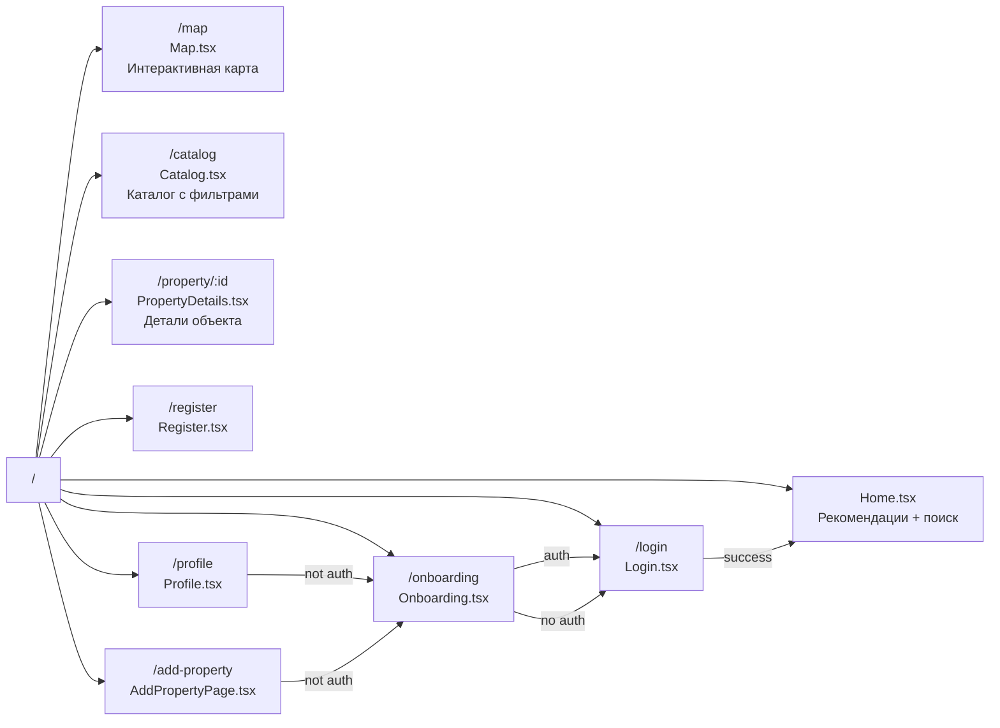

### 2.2 Управление состоянием (Redux Toolkit)

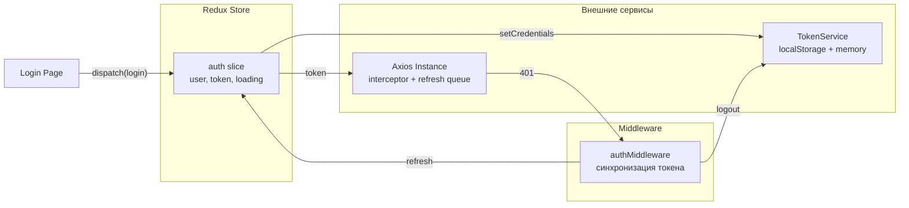

### 2.3 Компоненты shared/ui

| Компонент | Путь | Назначение |
|---|---|---|
| Header | `shared/ui/Header/` | Навигация, поиск, аутентификация |
| Map | `shared/ui/Map/` | Yandex Maps с динамической загрузкой |
| Card | `shared/ui/Card/` | Карточка объекта недвижимости |
| Modal | `shared/ui/Modal/` | Модальное окно |
| Button | `shared/ui/Button/` | Кнопка |
| Input | `shared/ui/Input/` | Поле ввода |
| RangeSlider | `shared/ui/RangeSlider/` | Слайдер диапазона цен и площади |
| CheckboxGroup | `shared/ui/CheckboxGroup/` | Группа чекбоксов |
| AuthLayout | `shared/ui/AuthLayout/` | Шаблон страниц аутентификации |
| ErrorBoundary | `shared/ui/ErrorBoundary/` | Отлов ошибок рендеринга |

---

## 3. Модель данных

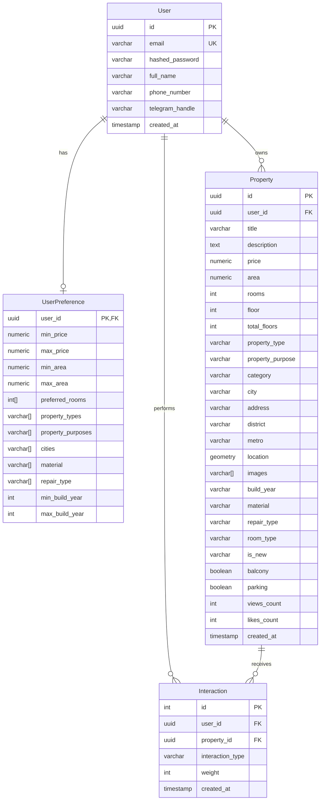

### 3.1 Таблицы БД

#### Users (пользователи)

| Колонка | Тип | Ограничения | Описание |
|---|---|---|---|
| `id` | UUID | PK, default gen_random_uuid() | Уникальный идентификатор |
| `email` | VARCHAR(255) | UNIQUE, NOT NULL | Email для входа |
| `hashed_password` | VARCHAR(255) | NOT NULL | bcrypt хеш пароля |
| `full_name` | VARCHAR(255) | NOT NULL | Отображаемое имя |
| `phone_number` | VARCHAR(50) | | PII — виден только владельцам объектов |
| `telegram_handle` | VARCHAR(100) | | PII |
| `created_at` | TIMESTAMP | default now() | Дата регистрации |

#### User Preferences (предпочтения)

| Колонка | Тип | Описание |
|---|---|---|
| `user_id` | UUID | PK, FK → users.id |
| `min_price` / `max_price` | NUMERIC(12,2) | Диапазон цен |
| `min_area` / `max_area` | NUMERIC(10,2) | Диапазон площади (м²) |
| `preferred_rooms` | INTEGER[] | Массив количества комнат |
| `property_types` | VARCHAR[] | Массив типов недвижимости |
| `property_purposes` | VARCHAR[] | Массив целей (продажа/аренда) |
| `cities` | VARCHAR[] | Предпочитаемые города |
| `material` | VARCHAR[] | Материал стен |
| `repair_type` | VARCHAR[] | Тип ремонта |
| `min_build_year` / `max_build_year` | INTEGER | Год постройки |

#### Properties (объекты недвижимости)

| Колонка | Тип | Описание |
|---|---|---|
| `id` | UUID | PK |
| `user_id` | UUID | FK → users.id (владелец) |
| `title` | VARCHAR(255) | Название |
| `description` | TEXT | Описание |
| `price` | NUMERIC(12,2) | Цена |
| `area` | NUMERIC(10,2) | Площадь (м²) |
| `rooms` | INTEGER | Количество комнат |
| `floor` / `total_floors` | INTEGER | Этаж / Всего этажей |
| `property_type` | VARCHAR(50) | Тип: apartment, studio, house, townhouse |
| `property_purpose` | VARCHAR(50) | Цель: sale, rent, daily_rent |
| `city` | VARCHAR(100) | Город |
| `address` | VARCHAR(500) | Адрес |
| `district` | VARCHAR(100) | Район |
| `metro` | VARCHAR(100) | Метро |
| `location` | GEOMETRY(Point, 4326) | **PostGIS** — пространственный индекс |
| `images` | VARCHAR[] | Массив URL изображений |
| `build_year` | VARCHAR(4) | Год постройки |
| `material` | VARCHAR(50) | Материал стен |
| `repair_type` | VARCHAR(50) | Тип ремонта |
| `room_type` | VARCHAR(50) | Тип комнат (separate, open) |
| `balcony` / `parking` | BOOLEAN | Балкон / Парковка |
| `is_new` | VARCHAR(3) | Новостройка (yes/no) |
| `sq_living` / `sq_kitchen` | NUMERIC(10,2) | Жилая / Кухня площадь |
| `views_count` / `likes_count` | INTEGER | Счётчики (default 0) |
| `created_at` | TIMESTAMP | Дата создания |

Индексы:
- `properties_location_gist` — GIST index на `location` для пространственных запросов
- `properties_user_id_idx` — по владельцу
- `properties_city_idx` — по городу
- `properties_purpose_idx` — по цели

#### Interactions (взаимодействия)

| Колонка | Тип | Описание |
|---|---|---|
| `id` | INTEGER | PK, autoincrement |
| `user_id` | UUID | FK → users.id |
| `property_id` | UUID | FK → properties.id |
| `interaction_type` | VARCHAR(20) | `like` или `view` |
| `weight` | INTEGER | Вес (по умолч. 5 для like) |
| `created_at` | TIMESTAMP | Дата |

**Ограничения:**
- UNIQUE(user_id, property_id, interaction_type) — предотвращает дубликаты

---

## 4. Рекомендательный движок

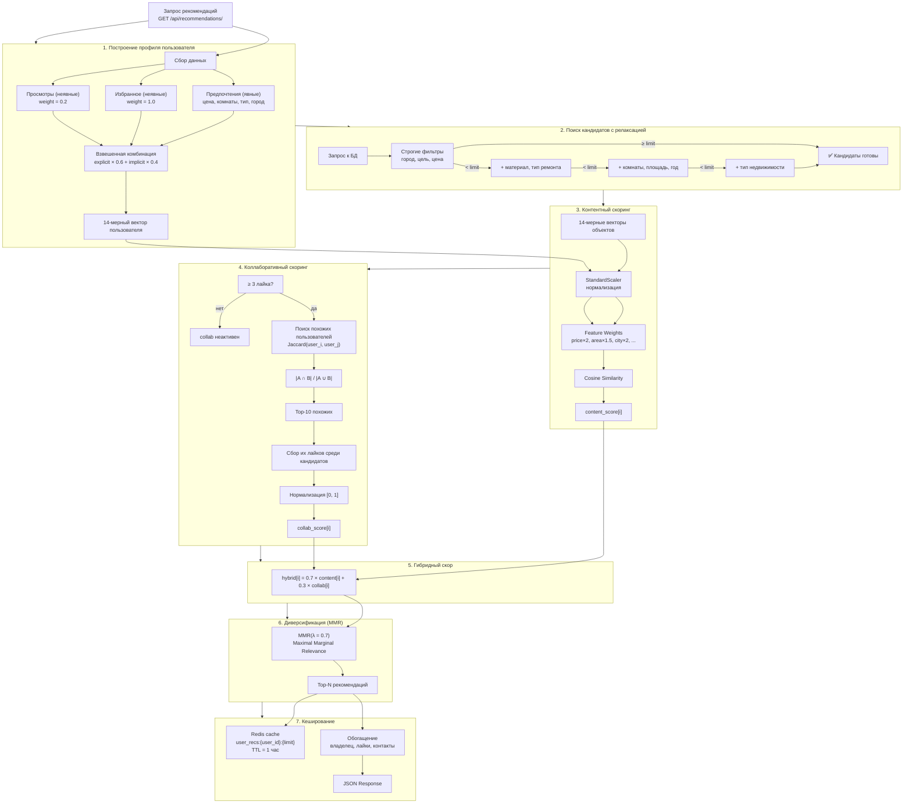

### 4.1 Feature Vector (14 измерений)

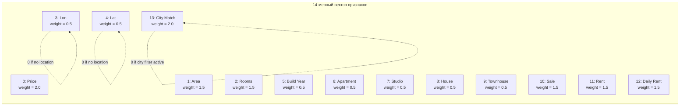

**Формирование вектора:**

```python
# Числовые признаки (масштабируются StandardScaler)
[price, area, rooms, lon, lat, build_year]

# One-hot тип недвижимости
[is_apartment, is_studio, is_house, is_townhouse]

# One-hot цель
[is_sale, is_rent, is_daily_rent]

# Совпадение города
[city_match]
```

**Настройка весов:**

| Индекс | Признак | Вес | Поведение |
|---|---|---|---|
| 0 | Price | 2.0 | Высокий приоритет |
| 1 | Area | 1.5 | Средний приоритет |
| 2 | Rooms | 1.5 | Средний приоритет |
| 3-4 | Lon / Lat | 0.5 | Обнуляется, если у пользователя нет геолокации |
| 5 | Build Year | 0.5 | Низкий приоритет |
| 6-9 | Property Type | 0.5 | One-hot |
| 10-12 | Purpose | 1.5 | Обнуляется, если фильтр по цели активен |
| 13 | City Match | 2.0 | Обнуляется, если фильтр по городу активен |

### 4.2 Алгоритмы

#### Контентная фильтрация (Content-Based)

```python
# 1. Нормализация признаков
norm_prop_vectors, scaler = StandardScaler().fit_transform(prop_vectors)
norm_user_vec = scaler.transform(user_vector)

# 2. Применение весов
norm_prop_vectors *= FEATURE_WEIGHTS
norm_user_vec *= FEATURE_WEIGHTS

# 3. Cosine Similarity
scores = cosine_similarity(norm_prop_vectors, norm_user_vec)
# → content_score[i] ∈ [-1, 1]
```

#### Коллаборативная фильтрация (Collaborative)

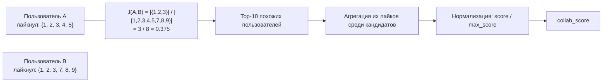

```python
def _find_similar_users(user_id: str) -> list[str]:
    my_favs = get_user_favorites(user_id)  # {1, 2, 3, 4, 5}
    if len(my_favs) < COLLAB_MIN_LIKES:    # 3
        return []                          # недостаточно данных

    all_users = get_users_liked_properties()
    # {"user_B": {1, 2, 3, 7, 8, 9}, "user_C": {5, 6}, ...}

    for uid, liked_set in all_users:
        intersection = my_favs & liked_set  # {1, 2, 3}
        union = my_favs | liked_set         # {1, 2, 3, 4, 5, 7, 8, 9}
        jaccard = len(intersection) / len(union)  # 3/8 = 0.375

    return top_10_by_jaccard
```

```python
def _score_collaborative(candidate_ids, similar_users):
    # similar_users = ["user_B", "user_C", ...]
    for uid in similar_users:
        liked = all_users[uid] & candidate_set
        for pid in liked:
            prop_scores[pid] += 1.0         # голос

    # Нормализация: 1.0 = лайкнули все похожие
    return {pid: score / max(prop_scores.values()) for pid, score in prop_scores.items()}
```

#### Гибридный скор

```python
if collab_scores:
    hybrid_score = (
        0.7 * content_score[i] +           # контентная составляющая
        0.3 * collab_scores.get(str(p.id), 0.0)  # коллаборативная (0 если нет сигнала)
    )
else:
    hybrid_score = content_score[i]         # fallback на контент
```

#### MMR Диверсификация (Maximal Marginal Relevance)

```python
def _diversify(scored_props, prop_vectors, user_vec, limit, lambda_param=0.7):
    # λ = 0.7 — баланс между релевантностью и разнообразием

    for i in remaining:
        relevance = scores[i]                    # насколько релевантен
        similarity_to_selected = max(            # насколько похож на уже выбранные
            pairwise_sim[i][j] for j in selected
        )
        mmr = lambda_param * relevance - (1 - lambda_param) * similarity_to_selected

    # Выбираем объект с максимальным MMR на каждом шаге
```

### 4.3 Фильтр-релаксация

Если кандидатов меньше, чем `limit`, фильтры постепенно смягчаются:

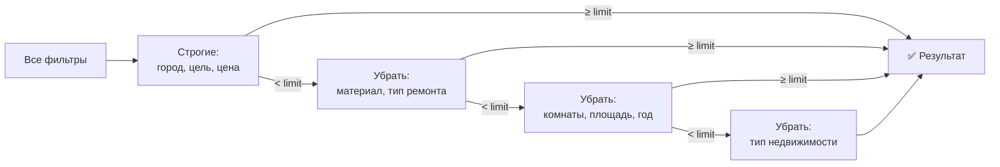

### 4.4 Кеширование

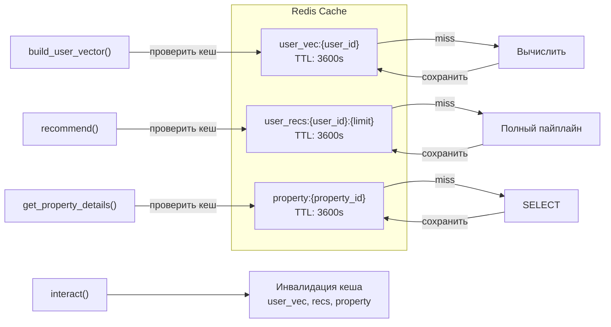

---

## 5. Жизненный цикл запроса

### 5.1 Рекомендации

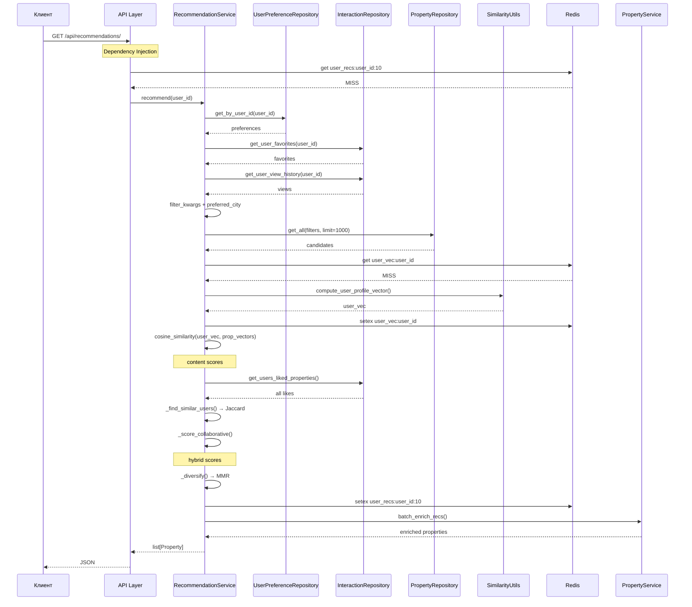

### 5.2 Взаимодействие (лайк/просмотр)

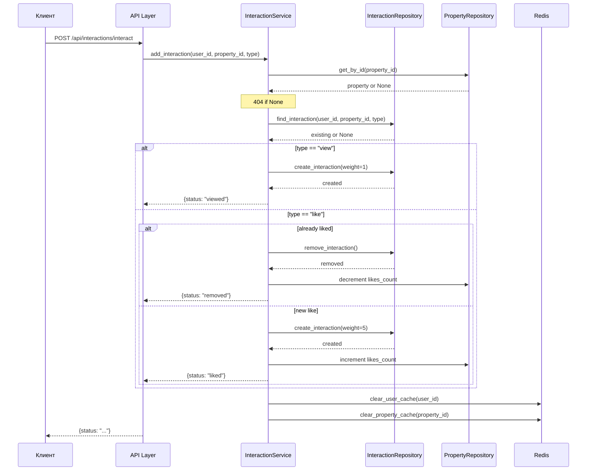

---

## 6. Инфраструктура

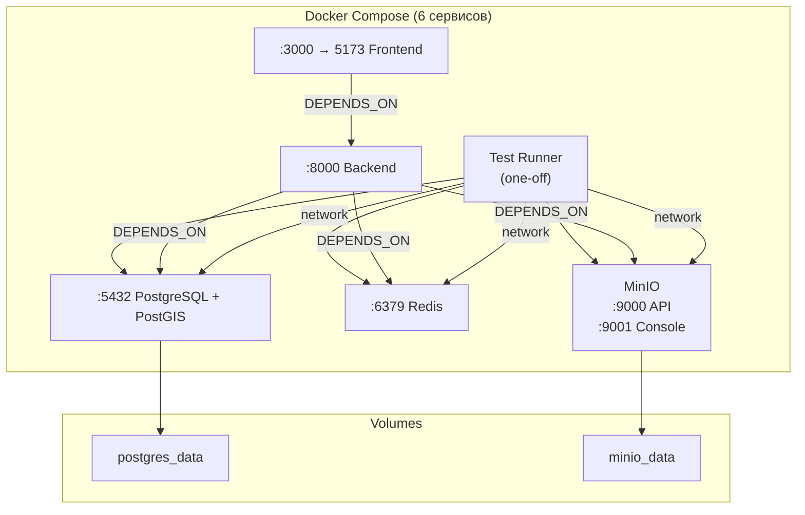

### 6.1 Сервисы Docker

| Сервис | Образ | Назначение | Порты | Healthcheck |
|---|---|---|---|---|
| **db** | `postgis/postgis:15-3.3` | PostgreSQL 15 + PostGIS | 5432 | `pg_isready` |
| **redis** | `redis:7-alpine` | Кеш Redis 7 | 6379 | `redis-cli ping` |
| **minio** | `minio/minio:latest` | S3-совместимое хранилище | 9000, 9001 | `/minio/health/live` |
| **backend** | сборка из `backend/` | FastAPI приложение | 8000 | `/health` |
| **frontend** | сборка из `frontend/` | React SPA | 3000 → 5173 | — |
| **test** | сборка из `backend/` | Тестовый раннер (profile=test) | — | — |

---

## 7. CI/CD Pipeline

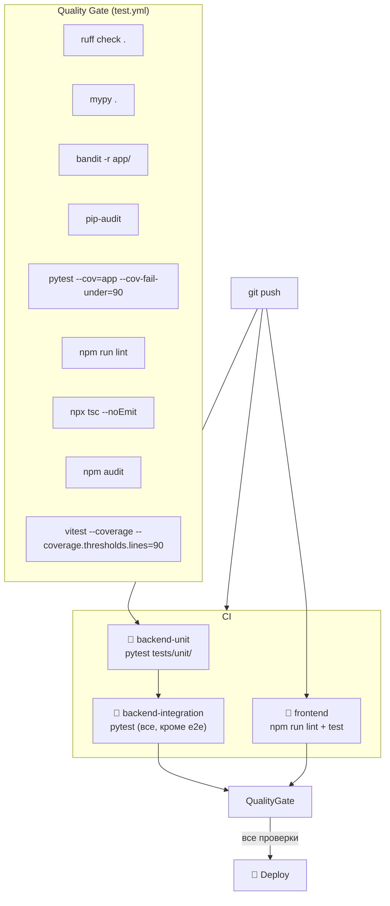

**ci.yml** — 3 job:
1. `backend-unit`: Python 3.12 → `pytest tests/unit/`
2. `frontend`: Node 20 → `npm ci` → `npm run lint` → `npm test -- --run`
3. `backend-integration` (needs 1 + 2): PostGIS + Redis → alembic migrations → `pytest` (все, кроме e2e)

**test.yml** — полный quality gate:
- **backend**: Ruff, MyPy, Bandit, pip-audit, pytest с coverage ≥ 90%
- **frontend**: ESLint, tsc, npm audit, vitest с coverage ≥ 90% lines
