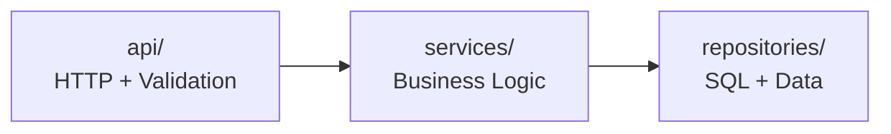

# Участие в разработке

## Git Flow

Проект использует **Git Flow**:

```
main        ───●────────────────●────────  релизные версии
                \              /
develop     ─────●────●────●──●────────  разработка
                 \  /    \  /
feature/    ──────●●──────●●───────────  новые возможности
```

### Основные ветки

| Ветка | Назначение |
|---|---|
| `main` | Релизные версии, только через merge из develop |
| `develop` | Интеграционная ветка для разработки |

### Feature-ветки

```bash
git checkout develop
git checkout -b feature/название-функции
# ... работа ...
git commit -m "feat: краткое описание"
git checkout develop
git merge feature/название-функции --no-ff
```

### Правила именования веток

| Тип | Префикс | Пример |
|---|---|---|
| Новая функция | `feature/` | `feature/collaborative-filtering` |
| Исправление | `fix/` | `fix/auth-refresh-bug` |
| Документация | `docs/` | `docs/api-reference` |
| Рефакторинг | `refactor/` | `refactor/property-service` |
| Тесты | `test/` | `test/recommendation-edge-cases` |
| Производительность | `perf/` | `perf/query-optimization` |

---

## Коммиты

### Формат сообщения

```
<type>: <краткое описание>
```

**Типы коммитов:**

| Тип | Когда использовать |
|---|---|
| `feat:` | Новая функциональность |
| `fix:` | Исправление бага |
| `docs:` | Изменения в документации |
| `refactor:` | Рефакторинг без изменения поведения |
| `test:` | Добавление или изменение тестов |
| `chore:` | Обслуживание: зависимости, конфиги, CI |
| `perf:` | Оптимизация производительности |
| `style:` | Форматирование, отступы (не CSS) |
| `ci:` | Изменения в CI/CD |

### Примеры

```
feat: add collaborative filtering (Jaccard similarity) to recommendation engine
fix: resolve 500 error on interaction toggle
docs: add API reference with all endpoints and schemas
refactor: split monolithic models.py into domain modules
test: add recommendations integration tests with mocked interactions
perf: batch queries and vectorize cosine similarity
```

---

## Code Style

### Python

- **Линтер**: Ruff (pycodestyle, pyflakes, isort, pep8-naming, pyupgrade, flake8-bugbear, flake8-simplify)
- **Тип-чекер**: MyPy (strict mode)
- **Длина строки**: 120 символов
- **Цель Python**: 3.12
- **Комментарии**: ЗАПРЕЩЕНЫ. Код должен быть самодокументируемым.

```python
# ❌ ПЛОХО — комментарий
# Increment counter and check limit
count += 1
if count >= MAX_LIMIT:
    raise LimitExceededError()

# ✅ ХОРОШО — самодокументируемый код
count += 1
if count >= MAX_LIMIT:
    raise LimitExceededError()
```

### TypeScript / React

- **Линтер**: ESLint 10 + typescript-eslint
- **Тип-чекер**: TypeScript strict mode
- **Архитектура**: FSD (Feature-Sliced Design)
- **Стили**: SCSS
- **Состояние**: Redux Toolkit

### Запуск проверок

```bash
# Python
cd backend && ruff check . && mypy .

# TypeScript
cd frontend && npm run lint && npx tsc --noEmit
```

---

## Архитектурные правила

### Бэкенд: 3-layer



1. **API Layer** не должен обращаться к репозиториям напрямую — только через сервисы
2. **Service Layer** содержит всю бизнес-логику
3. **Repository Layer** содержит только SQL-запросы
4. **Сессия БД** создаётся через `Depends(get_db)` и передаётся в сервис

### Фронтенд: FSD

```
shared/  ←  entities/  ←  features/  ←  widgets/  ←  pages/  ←  app/
```

1. Зависимости только сверху вниз
2. `shared/` не зависит ни от чего
3. `pages/` может зависеть от всех нижележащих слоёв

---

## Тестирование

- **Покрытие**: ≥ 90% (и backend, и frontend)
- **Backend**: pytest + pytest-asyncio + pytest-cov
- **Frontend**: Vitest + Testing Library + jsdom

Подробнее: [TESTING.md](TESTING.md)

---

## Pull Request Process

1. Убедитесь, что все проверки проходят:
   - `ruff check .` — 0 errors
   - `mypy .` — 0 errors
   - `pytest --cov=app` — 100% pass, ≥ 90% coverage
   - `npm run lint` — 0 errors
   - `npx tsc --noEmit` — 0 errors
   - `npm test -- --run` — 100% pass
   - `bandit -c pyproject.toml -r app/` — 0 high severity
   - `pip-audit` — 0 vulnerabilities
   - `npm audit` — 0 vulnerabilities

2. Создайте PR в ветку `develop`
3. Дождитесь прохождения CI
4. Получите review
5. Merge через `--no-ff`

---

## Окружение

```bash
cp .env.example .env
docker compose up -d
```

Подробнее: [DOCKER.md](DOCKER.md), [README.md](README.md)
