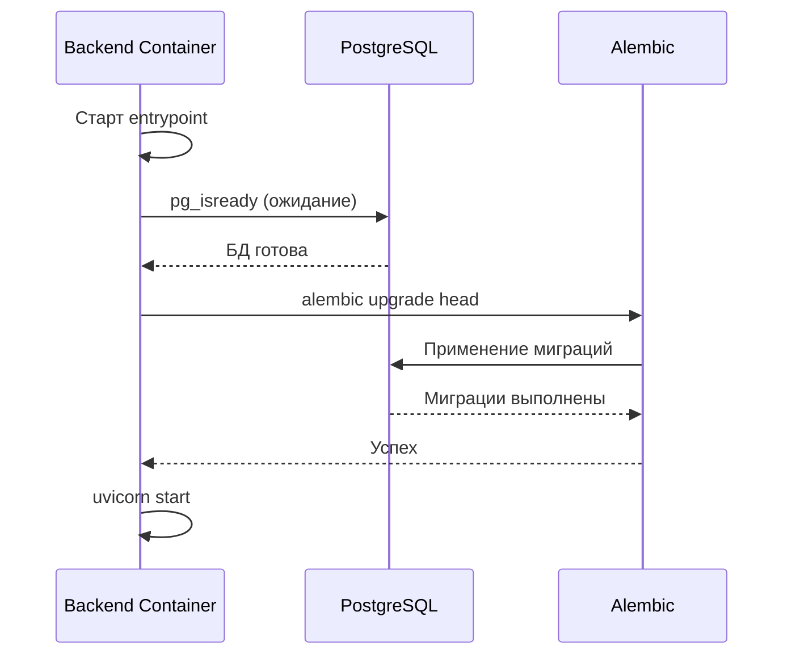
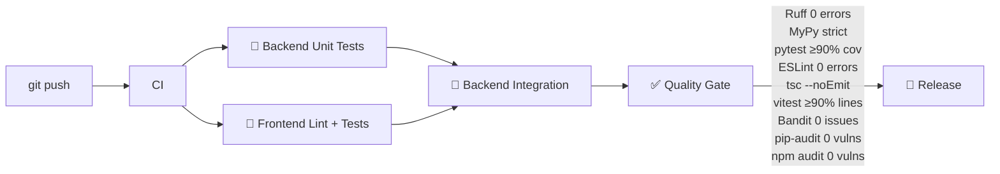

# Деплой

## Требования

- Docker 24+ и Docker Compose 2.20+
- Git
- Доступ к Docker registry (не требуется для локальной сборки)
- API-ключи Yandex (Maps + Geocoder)

## Подготовка окружения

### 1. Клонирование

```bash
git clone <repo-url>
cd real-estate-recommendation-system
```

### 2. Переменные окружения

Скопируйте шаблон и заполните обязательные переменные:

```bash
cp .env.example .env
```

**Обязательные переменные:**

| Переменная | Описание | Пример |
|---|---|---|
| `SECRET_KEY` | Ключ JWT, минимум 32 символа | `openssl rand -hex 32` |
| `YANDEX_API_KEY` | API-ключ Yandex Geocoder | — |
| `VITE_YANDEX_MAPS_API_KEY` | API-ключ Yandex Maps | — |
| `VITE_YANDEX_GEOCODER_API_KEY` | API-ключ Yandex Geocoder (фронтенд) | — |

**Рекомендации для production:**

```bash
# Сгенерировать надёжный SECRET_KEY
SECRET_KEY=$(openssl rand -hex 32)

# Установить сложные пароли для БД и MinIO
POSTGRES_PASSWORD=$(openssl rand -base64 16)
S3_ACCESS_KEY=$(openssl rand -hex 16)
S3_SECRET_KEY=$(openssl rand -base64 32)
```

## Запуск

### Разработка

```bash
# Запуск всех сервисов
docker compose up -d

# Просмотр логов
docker compose logs -f

# Применение миграций (выполняется автоматически при старте бэкенда)
# Ручной запуск:
docker compose run --rm backend alembic upgrade head
```

### Production

На production требуется дополнительная настройка:

1. **Reverse proxy** — для продакшена рекомендуется Traefik или Nginx с автоматическим LetsEncrypt
2. **Сети** — ограничить доступ к MinIO и Redis только для бэкенда
3. **Лимиты** — настроить лимиты на размер загружаемых файлов (10 MB) через reverse proxy
4. **Мониторинг** — подключить Prometheus + Grafana для отслеживания метрик

```bash
# Production сборка
docker compose -f docker-compose.yml -f docker-compose.prod.yml up -d

# Проверка состояния
docker compose ps
docker compose logs --tail=50 backend
```

## Миграции

Миграции выполняются автоматически при старте бэкенда через `docker-entrypoint.sh`:



Ручное управление:

```bash
# Создать новую миграцию
docker compose run --rm backend alembic revision --autogenerate -m "description"

# Откатить миграцию
docker compose run --rm backend alembic downgrade -1

# Просмотр истории
docker compose run --rm backend alembic history
```

## CI/CD Pipeline



Pipeline запускается на `push` и `pull_request` в ветки `develop` и `main`.

### Jobs

| Job | Инструменты | Длительность |
|---|---|---|
| **Backend Unit** | pytest | ~2 min |
| **Frontend** | ESLint, tsc, vitest | ~3 min |
| **Backend Integration** | pytest (PostGIS + Redis + MinIO) | ~5 min |
| **Quality Gate** | Ruff, MyPy, Bandit, pip-audit, npm audit | ~1 min |

## Безопасность

### Secrets

- Никогда не коммитьте `.env` файлы в репозиторий
- Для GitHub Actions secrets используйте `Settings → Secrets and variables → Actions`
- В CI используются тестовые ключи (не предназначены для production)

### SAST / SCA

```bash
# Локальная проверка
cd backend
bandit -c pyproject.toml -r app/
pip-audit

cd frontend
npm audit
```

### Production checklist

- [ ] Сгенерирован надёжный `SECRET_KEY` (≥ 32 символа)
- [ ] Изменены пароли по умолчанию для PostgreSQL и MinIO
- [ ] Настроен reverse proxy с HTTPS (TLS 1.3)
- [ ] Включены healthchecks для всех сервисов
- [ ] Ограничен CORS (не `*`)
- [ ] Отключен debug режим
- [ ] Настроено резервное копирование volumes (postgres_data, minio_data)
- [ ] Ограничен доступ к MinIO Console (порт 9001)

## Тестирование

```bash
# Полный набор тестов с coverage
docker compose run --rm test

# Unit тесты
docker compose run --rm test pytest tests/unit/ -v

# Интеграционные тесты
docker compose run --rm test pytest tests/integration/ -v

# Фронтенд
cd frontend && npm test -- --run
```

## Мониторинг и логи

```bash
# Логи всех сервисов
docker compose logs -f

# Логи конкретного сервиса
docker compose logs -f backend

# Последние N строк
docker compose logs --tail=100 backend
```

## Обновление

```bash
# Получить последние изменения
git pull origin main

# Пересобрать и перезапустить
docker compose build --pull
docker compose up -d

# Применить новые миграции (автоматически при старте)
docker compose restart backend
```

## Откат

```bash
# Откатить версию кода
git checkout <previous-tag>
docker compose build backend
docker compose up -d

# Откатить миграцию БД
docker compose run --rm backend alembic downgrade -1
```
