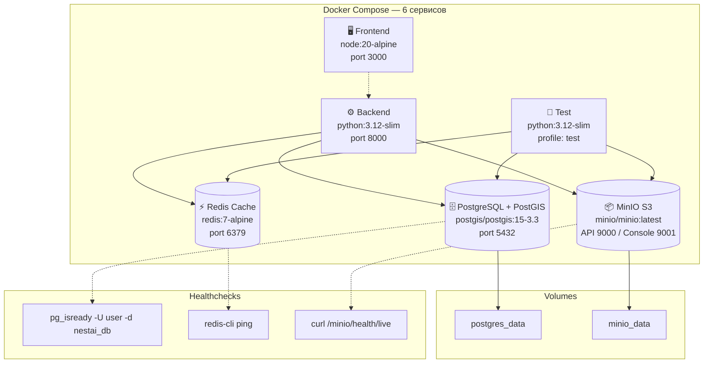

# Docker окружение

## Обзор

Проект использует Docker Compose для оркестрации 6 сервисов, обеспечивающих полное окружение для разработки, тестирования и production-развёртывания.



## Сервисы

### `db` — PostgreSQL + PostGIS

| Параметр | Значение |
|---|---|
| Образ | `postgis/postgis:15-3.3` |
| Порт | 5432 |
| БД | `nestai_db` / `nestai_test` |
| Пользователь | `user` (переопределяется через `POSTGRES_USER`) |
| Volume | `postgres_data:/var/lib/postgresql/data` |
| Healthcheck | `pg_isready -U user -d nestai_db`, interval 10s, timeout 5s, retries 3 |

### `redis` — Redis Cache

| Параметр | Значение |
|---|---|
| Образ | `redis:7-alpine` |
| Порт | 6379 |
| Healthcheck | `redis-cli ping`, interval 10s, timeout 5s, retries 3 |

### `minio` — S3-совместимое хранилище

| Параметр | Значение |
|---|---|
| Образ | `minio/minio:latest` |
| Порты | 9000 (API), 9001 (Console) |
| Креденшелы | `MINIO_ROOT_USER=minioadmin`, `MINIO_ROOT_PASSWORD=minioadmin` |
| Volume | `minio_data:/data` |
| Healthcheck | `curl -f http://localhost:9000/minio/health/live`, interval 10s, timeout 5s, retries 3 |

### `backend` — FastAPI приложение

| Параметр | Значение |
|---|---|
| Dockerfile | `backend/Dockerfile` |
| Базовый образ | `python:3.12-slim` |
| Порт | 8000 |
| Пользователь | `appuser` (non-root) |
| Entrypoint | `docker-entrypoint.sh` — ожидает БД, запускает миграции |
| Команда | `uvicorn app.main:app --host 0.0.0.0 --port 8000` |
| Restart | `unless-stopped` |
| Зависимости | `db`, `redis`, `minio` (ожидает healthcheck) |

**Dockerfile (`backend/Dockerfile`):**

```dockerfile
FROM python:3.12-slim

WORKDIR /app

RUN apt-get update && apt-get install -y \
    build-essential libpq-dev postgresql-client \
    && rm -rf /var/lib/apt/lists/*

COPY requirements.txt .
RUN pip install --no-cache-dir -r requirements.txt

COPY . .
ENV PYTHONPATH=/app

RUN groupadd -r appuser && useradd -r -g appuser -d /app -s /bin/bash appuser \
    && chown -R appuser:appuser /app /usr/local/bin

EXPOSE 8000
COPY docker-entrypoint.sh /usr/local/bin/
RUN chmod +x /usr/local/bin/docker-entrypoint.sh
USER appuser

ENTRYPOINT ["docker-entrypoint.sh"]
CMD ["uvicorn", "app.main:app", "--host", "0.0.0.0", "--port", "8000"]
```

**Entrypoint (`backend/docker-entrypoint.sh`):**

```bash
#!/bin/bash
set -e

echo "Waiting for database..."
while ! pg_isready -h db -p 5432 -U user; do
    echo "Database is unavailable - sleeping"
    sleep 1
done

echo "Enabling PostGIS extension..."
PGPASSWORD="${PGPASSWORD:-${POSTGRES_PASSWORD:-password}}" psql -h db -U "${POSTGRES_USER:-user}" -d "${POSTGRES_DB:-nestai_db}" -c "CREATE EXTENSION IF NOT EXISTS postgis" 2>/dev/null || echo "PostGIS extension may already exist"

echo "Running migrations..."
alembic upgrade head

echo "Starting application..."
exec "$@"
```

### `frontend` — React SPA

| Параметр | Значение |
|---|---|
| Dockerfile | `frontend/Dockerfile` |
| Базовый образ | `node:20-alpine` |
| Порт | 3000 → 5173 (serve внутренний) |
| Пользователь | `node` (non-root) |
| Restart | `unless-stopped` |
| Зависимости | `backend` |

**Dockerfile (`frontend/Dockerfile`):**

```dockerfile
FROM node:20-alpine

WORKDIR /app

COPY package*.json ./
RUN npm install

COPY . .
RUN npm run build && npm install -g serve

RUN chown -R node:node /app
USER node

EXPOSE 5173
CMD ["serve", "-s", "dist", "-l", "5173"]
```

### `test` — Тестовый сервис

| Параметр | Значение |
|---|---|
| Dockerfile | `backend/Dockerfile` (тот же) |
| Профиль | `test` (запускается только с `--profile test`) |
| Команда | `pytest --cov=app --cov-report=term-missing --cov-report=html:coverage_html --cov-fail-under=90 -v` |
| БД | `nestai_test` |
| Зависимости | `db`, `redis`, `minio` |

## Сети

Все сервисы работают в изолированной сети Docker Compose (default bridge). Коммуникация между сервисами происходит по именам контейнеров:

| Имя хоста | Сервис |
|---|---|
| `db` | PostgreSQL |
| `redis` | Redis |
| `minio` | MinIO |
| `backend` | FastAPI |
| `frontend` | Frontend |

## Volumes

| Volume | Монтирование | Назначение |
|---|---|---|
| `postgres_data` | `/var/lib/postgresql/data` | Персистентные данные БД |
| `minio_data` | `/data` | Файлы изображений |

## Переменные окружения

### Основные

| Переменная | По умолчанию | Описание |
|---|---|---|
| `POSTGRES_USER` | `user` | Пользователь PostgreSQL |
| `POSTGRES_PASSWORD` | `password` | Пароль PostgreSQL |
| `SECRET_KEY` | — | Ключ JWT (≥ 32 символа) |
| `YANDEX_API_KEY` | — | API-ключ Yandex |
| `S3_ACCESS_KEY` | `minioadmin` | MinIO access key |
| `S3_SECRET_KEY` | `minioadmin` | MinIO secret key |
| `S3_BUCKET` | `nestai-images` | MinIO bucket |
| `VITE_YANDEX_MAPS_API_KEY` | — | API-ключ Yandex Maps |
| `VITE_YANDEX_GEOCODER_API_KEY` | — | API-ключ Yandex Geocoder |
| `PEXELS_API_KEY` | — | API-ключ Pexels (для populate-скриптов) |

### Бэкенд (backend)

```yaml
DATABASE_URL: postgresql+asyncpg://user:password@db:5432/nestai_db
REDIS_URL: redis://redis:6379/0
SECRET_KEY: ${SECRET_KEY}
YANDEX_API_KEY: ${YANDEX_API_KEY}
S3_ENDPOINT: http://minio:9000
S3_ACCESS_KEY: ${S3_ACCESS_KEY:-minioadmin}
S3_SECRET_KEY: ${S3_SECRET_KEY:-minioadmin}
S3_BUCKET: ${S3_BUCKET:-nestai-images}
S3_PUBLIC_URL: ${S3_PUBLIC_URL:-http://localhost:8000/api/images}
```

### Фронтенд (frontend)

```yaml
VITE_API_URL: http://localhost:8000
VITE_YANDEX_MAPS_API_KEY: ${VITE_YANDEX_MAPS_API_KEY}
VITE_YANDEX_GEOCODER_API_KEY: ${VITE_YANDEX_GEOCODER_API_KEY}
```

## Основные команды

```bash
# Сборка всех сервисов
docker compose build

# Запуск всех сервисов
docker compose up -d

# Просмотр логов
docker compose logs -f backend
docker compose logs -f frontend

# Перезапуск сервиса
docker compose restart backend

# Выполнение команд в контейнере
docker compose exec backend bash
docker compose exec db psql -U user -d nestai_db

# Остановка всех сервисов
docker compose down

# Остановка с удалением volumes (⚠️ удалит все данные)
docker compose down -v

# Запуск тестов
docker compose run --rm test

# Запуск конкретного теста
docker compose run --rm test pytest tests/unit/services/test_recommendation_service.py -v

# Выполнение миграций
docker compose run --rm backend alembic upgrade head

# Загрузка тестовых данных
docker compose run --rm backend python populate_v4.py
```

## Healthchecks

Каждый сервис имеет healthcheck для определения готовности:

| Сервис | Команда | Интервал |
|---|---|---|
| `db` | `pg_isready -U user -d nestai_db` | 10s |
| `redis` | `redis-cli ping` | 10s |
| `minio` | `curl -f http://localhost:9000/minio/health/live` | 10s |

Бэкенд ожидает healthcheck всех зависимостей (`depends_on` с `condition: service_healthy`) и дополнительно проверяет доступность БД в `docker-entrypoint.sh`.

## Принципы безопасности

- **Non-root пользователи**: `appuser` в backend, `node` в frontend
- **Минимальные образы**: `python:3.12-slim`, `node:20-alpine` — без лишних утилит
- **Изолированная сеть**: все сервисы внутри Docker сети, наружу торчат только необходимые порты
- **Healthchecks**: каждый сервис проверяет своё состояние, что позволяет корректно управлять порядком запуска
