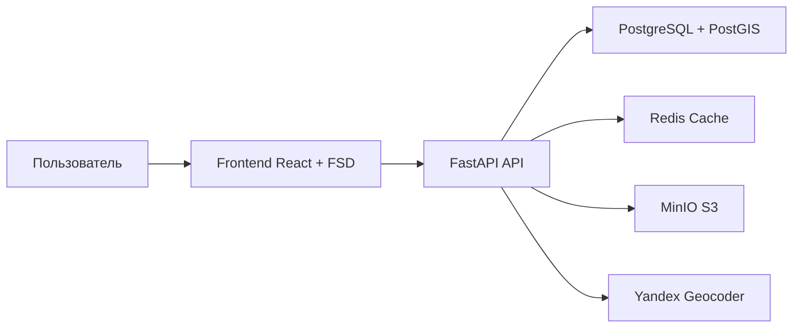

# nestAI

Гибридная рекомендательная система для недвижимости — комбинация контентной фильтрации (content-based) и коллаборативной фильтрации (Jaccard similarity). Бэкенд на FastAPI + React + PostGIS.



## Стек технологий

| Слой | Технологии |
|---|---|
| Бэкенд | Python 3.12, FastAPI, SQLAlchemy 2.0 (async), asyncpg |
| Фронтенд | React 19, TypeScript, Redux Toolkit, Vite, FSD архитектура |
| База данных | PostgreSQL 15 + PostGIS |
| Кеширование | Redis 7 |
| Файлы | MinIO (S3-совместимое) |
| Карты | Yandex Maps API 3 + Yandex Geocoder |
| ML | scikit-learn (cosine similarity, StandardScaler) |
| CI | GitHub Actions — Ruff, MyPy, ESLint, pytest (90% cov), vitest (90% cov), Bandit, pip-audit, npm audit |

## Быстрый старт

```bash
docker compose up -d
```

Сервисы:
- **Бэкенд** — http://localhost:8000
- **Фронтенд** — http://localhost:3000
- **MinIO Console** — http://localhost:9001

## Запуск тестов

```bash
# Бэкенд (все тесты, включая интеграционные и e2e)
docker compose run --rm test

# Фронтенд
cd frontend && npm test -- --run

# Линтеры и SAST
cd backend && ruff check . && mypy . && bandit -c pyproject.toml -r app/
cd frontend && npm run lint && npx tsc --noEmit
```

## Структура проекта

```
real-estate-recommendation-system/
  backend/          # Python FastAPI (3 слоя: api → service → repository)
  frontend/         # React TypeScript (FSD: app/pages/features/entities/widgets/shared)
  docker-compose.yml
```

## Документация

- [Архитектура](ARCHITECTURE.md)
- [API Reference](API.md)
- [Участие в разработке](CONTRIBUTING.md)
- [Тестирование](TESTING.md)
- [Docker окружение](DOCKER.md)
- [Деплой](DEPLOYMENT.md)
- [Безопасность](SECURITY.md)
- [Changelog](CHANGELOG.md)

## Переменные окружения

Скопируйте `.env.example` в `.env` и заполните значения:

```bash
cp .env.example .env
```

Ключевые переменные: `JWT_SECRET_KEY`, `YANDEX_API_KEY`, `S3_*` (MinIO), `DATABASE_URL*`.
