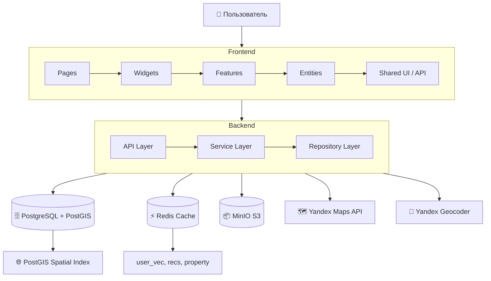
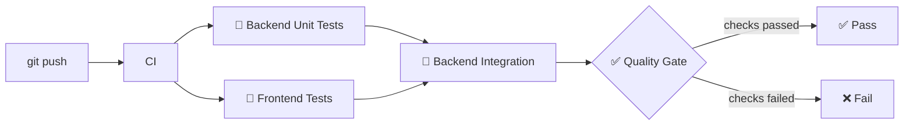

# nestAI 🏡

**Гибридная рекомендательная система для недвижимости** — персонализированный подбор объектов на основе предпочтений пользователя, истории просмотров и коллаборативной фильтрации.



## Возможности

| Возможность | Описание |
|---|---|
| 🎯 **Персонализация** | Гибридные рекомендации: контентная фильтрация (cosine similarity) + коллаборативная (Jaccard) |
| 🗺 **Карта** | Интерактивная карта с кластеризацией, поиском по bounding box, фильтрами |
| 🔍 **Поиск и фильтры** | 15+ фильтров: цена, метраж, комнаты, тип, город, материал, ремонт, год постройки, радиус на карте |
| ❤️ **Избранное** | Лайки и история просмотров с переключением |
| 👤 **Профиль** | Настройка предпочтений, управление объявлениями, контактные данные |
| 📸 **Изображения** | Загрузка изображений через MinIO (S3) с валидацией (до 10 файлов, до 10 MB) |
| 🗺 **Геокодирование** | Автозаполнение адреса через Yandex Geocoder |
| 🔐 **Безопасность** | JWT, bcrypt, PII control, SAST (Bandit), SCA (pip-audit, npm audit) |

## Стек технологий

### Бэкенд

| Компонент | Технология | Назначение |
|---|---|---|
| Язык | Python 3.12 | — |
| Веб-фреймворк | FastAPI 0.111 | REST API |
| ORM | SQLAlchemy 2.0 (async) | Работа с БД |
| Драйвер БД | asyncpg 0.29 | Асинхронное подключение к PostgreSQL |
| Миграции | Alembic 1.13 | Управление схемой БД |
| Валидация | Pydantic v2 | Схемы запросов/ответов |
| Аутентификация | JWT (PyJWT) + bcrypt | Регистрация, логин, refresh |
| ML | scikit-learn 1.4 | Cosine similarity, StandardScaler |
| Кеширование | Redis 5.0 | Рекомендации, векторы пользователей |
| Файлы | MinIO (minio-py 7.2) | S3-совместимое хранилище изображений |
| Геоданные | PostGIS + Yandex Geocoder | Пространственные запросы, геокодирование |
| HTTP-клиент | httpx | Запросы к Yandex API |

### Фронтенд

| Компонент | Технология | Назначение |
|---|---|---|
| Фреймворк | React 19 | UI |
| Язык | TypeScript 6 | Типизация |
| Сборщик | Vite 8 | Dev-сервер и сборка |
| Состояние | Redux Toolkit 2.11 | Управление состоянием |
| Роутинг | React Router DOM 7 | Навигация |
| HTTP | Axios 1.16 | Запросы к API |
| Карты | Yandex Maps API 3 | Интерактивная карта |
| Стили | SCSS/Sass 1.99 | Дизайн-система |
| UI | Swiper 12 | Карусели |

### Инфраструктура

| Компонент | Технология |
|---|---|
| Контейнеризация | Docker + Docker Compose |
| CI/CD | GitHub Actions |
| Линтер Python | Ruff |
| Тип-чекер Python | MyPy (strict) |
| SAST Python | Bandit |
| SCA Python | pip-audit |
| Линтер JS/TS | ESLint 10 |
| SAST JS/TS | npm audit |
| Тесты Python | pytest + pytest-asyncio + pytest-cov |
| Тесты JS/TS | Vitest + Testing Library |
| Покрытие Python | ≥ 90% |
| Покрытие JS/TS | ≥ 90% lines |

## Быстрый старт

### 1. Клонирование и настройка

```bash
git clone <repo-url>
cd real-estate-recommendation-system
cp .env.example .env
```

### 2. Запуск

```bash
docker compose up -d
```

**Сервисы:**

| Сервис | Адрес | Назначение |
|---|---|---|
| Бэкенд | http://localhost:8000 | FastAPI приложение |
| Фронтенд | http://localhost:3000 | React SPA |
| PostgreSQL | localhost:5432 | База данных |
| Redis | localhost:6379 | Кеш |
| MinIO API | localhost:9000 | S3-хранилище |
| MinIO Console | http://localhost:9001 | Управление файлами |

### 3. Начальная загрузка данных

После первого запуска выполните миграции (выполняются автоматически при старте):

```bash
docker compose run --rm backend alembic upgrade head
```

Для загрузки тестовых данных (500+ объектов по 10 городам):

```bash
docker compose run --rm backend python populate_v4.py
```

### 4. Проверка

```bash
# Проверить, что бэкенд отвечает
curl http://localhost:8000/
# → {"message": "Welcome to nestAI API"}
```

## Структура проекта

```
nestai/
├── backend/                        # Python FastAPI бэкенд
│   ├── app/
│   │   ├── api/endpoints/          # 🎮 API слой — маршруты, валидация, auth
│   │   ├── services/               # ⚙ Сервисный слой — бизнес-логика
│   │   ├── repositories/           # 📦 Репозитории — SQL запросы
│   │   ├── models/                 # 📊 ORM модели (SQLAlchemy)
│   │   ├── schemas/                # 📋 Pydantic схемы (DTO)
│   │   └── core/                   # 🔧 Ядро: config, db, redis, security, similarity
│   ├── alembic/                    # 🗄 Миграции БД
│   ├── tests/                      # 🧪 Тесты (unit / integration / e2e)
│   └── Dockerfile
├── frontend/                       # React TypeScript фронтенд
│   ├── src/
│   │   ├── app/                    # Инициализация, store, routing, стили
│   │   ├── pages/                  # Страницы (Home, Map, Catalog, Profile...)
│   │   ├── features/               # Фичи (propertyForm, uploadImages)
│   │   ├── entities/               # Сущности (property, user)
│   │   ├── widgets/                # Компоненты (FilterPanel)
│   │   └── shared/                 # Инфраструктура: API, UI-kit, lib
│   └── Dockerfile
└── docker-compose.yml              # 🐳 Оркестрация 6 сервисов
```

## Тестирование

```bash
# ── Бэкенд ──────────────────────────────────────────

# Все тесты (unit + integration + e2e) с coverage
docker compose run --rm test

# Только unit тесты
docker compose run --rm test pytest tests/unit/ -v

# Только интеграционные тесты
docker compose run --rm test pytest tests/integration/ -v

# Конкретный файл
docker compose run --rm test pytest tests/unit/services/test_recommendation_service.py -v

# ── Фронтенд ────────────────────────────────────────

# Все тесты
cd frontend && npm test -- --run

# Режим watch
cd frontend && npm test

# ── Линтеры ─────────────────────────────────────────

cd backend && ruff check . && mypy .
cd frontend && npm run lint && npx tsc --noEmit

# ── Безопасность ─────────────────────────────────────

cd backend && bandit -c pyproject.toml -r app/ && pip-audit
cd frontend && npm audit
```

## Переменные окружения

| Переменная | Обязательная | Описание |
|---|---|---|
| `DATABASE_URL` | ✅ | URL подключения к PostgreSQL |
| `DATABASE_URL_TEST` | ✅ | URL тестовой БД |
| `JWT_SECRET_KEY` | ✅ | Ключ для подписи JWT (≥ 32 символа) |
| `YANDEX_API_KEY` | ✅ | API-ключ Yandex Maps и Geocoder |
| `S3_ENDPOINT` | ✅ | MinIO endpoint |
| `S3_ACCESS_KEY` | ✅ | MinIO access key |
| `S3_SECRET_KEY` | ✅ | MinIO secret key |
| `S3_BUCKET` | ✅ | MinIO bucket для изображений |
| `REDIS_URL` | ✅ | URL подключения к Redis |
| `CORS_ORIGINS` | ❌ | Разрешённые CORS origins (по умолч. `*`) |

## CI/CD Pipeline



## Документация

| Документ | Описание |
|---|---|
| [Архитектура](ARCHITECTURE.md) | Полное описание архитектуры: 3-layer, FSD, data model, алгоритм рекомендаций |
| [API Reference](API.md) | Все 24 эндпоинта: методы, параметры, схемы, примеры curl |
| [Docker окружение](DOCKER.md) | Детальное описание docker-compose, сервисов, сетей, volumes |
| [Тестирование](TESTING.md) | Гайд по запуску тестов, coverage, паттерны тестирования |
| [Участие в разработке](CONTRIBUTING.md) | Git flow, commit convention, code style, PR process |
| [Безопасность](SECURITY.md) | SAST/SCA, JWT, password policy, PII |
| [Деплой](DEPLOYMENT.md) | Переменные окружения, миграции, production настройки |
| [Changelog](CHANGELOG.md) | История версий |

## Лицензия

MIT
