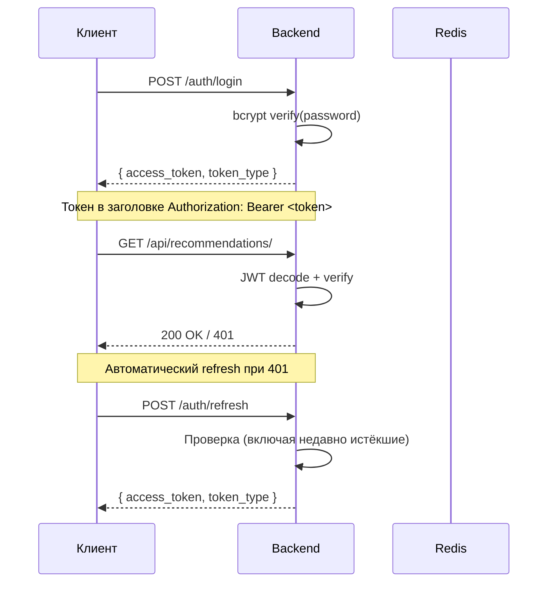
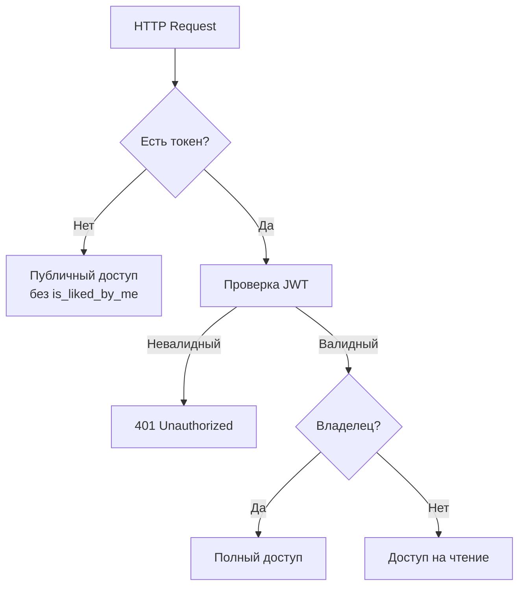

# Безопасность

## SAST / SCA

В CI настроены автоматические проверки безопасности:

| Инструмент | Тип | Что проверяет |
|---|---|---|
| **Bandit** | SAST | Python — поиск уязвимостей в коде (SQL injection, hardcoded secrets, unsafe eval и т.д.) |
| **pip-audit** | SCA | Python — проверка зависимостей на известные CVE |
| **npm audit** | SCA | JavaScript — проверка зависимостей на известные уязвимости |

```bash
# Локальный запуск
cd backend && bandit -c pyproject.toml -r app/ && pip-audit
cd frontend && npm audit
```

## Аутентификация

### JWT

- **Алгоритм**: HS256
- **Срок действия**: access token — 30 минут, refresh — 7 дней
- **Секретный ключ**: минимум 32 символа, проверяется при старте приложения
- **Refresh**: позволяет получить новый token из истёкшего (но не более 7 дней назад)



### Хеширование паролей

- **Алгоритм**: bcrypt
- **Соль**: автоматическая, встроенная в hash
- **Политика паролей**:
  - Минимум 8 символов
  - Минимум 1 заглавная буква
  - Минимум 1 строчная буква
  - Минимум 1 цифра

## Управление доступом

### Роли

| Роль | Доступ |
|---|---|
| **Неаутентифицированный** | Просмотр объектов, карта, метаданные |
| **Аутентифицированный** | Всё + лайки, избранное, рекомендации |
| **Владелец объекта** | Редактирование/удаление своих объектов |

### Проверка прав



- **Защищённые эндпоинты**: `POST/PUT/DELETE /api/properties/*`, `/api/interactions/*`, `/api/recommendations/*`, `/user/*`
- **Публичные эндпоинты**: `GET /api/properties/*`, `GET /api/images/*`, `/auth/register`, `/auth/login`, `/api/geocode/*`

## PII (Персональные данные)

### Какие данные считаются PII

| Поле | Где хранится | Кто видит |
|---|---|---|
| `phone_number` | users.phone_number | Только владельцы объектов при просмотре их объявлений |
| `telegram_handle` | users.telegram_handle | Только владельцы объектов |
| `full_name` | users.full_name | Все |
| `email` | users.email | Только сам пользователь |

### Защита PII

- `phone_number` и `telegram_handle` возвращаются только в `OwnerOut` при запросе деталей объекта
- Нельзя очистить все контактные данные, если у пользователя есть активные объявления
- Пароли не возвращаются в ответах API

## Docker безопасность

- **Non-root user**: приложение запускается от `appuser` (UID 1000)
- **Минимальные образы**: `python:3.12-slim`, `node:20-alpine`
- **Healthchecks**: каждый сервис проверяет своё состояние
- **Сети**: все сервисы в изолированной Docker сети

## Безопасность кода

### Защита от mass assignment

```python
# Только разрешённые поля могут быть обновлены
ALLOWED_UPDATE_FIELDS = {
    "title", "description", "price", "area", "rooms",
    "floor", "total_floors", "address", "lat", "lon",
    # ...
}
```

### Проверка владельца

```python
if property.user_id != current_user.id:
    raise HTTPException(status_code=403, detail="Not authorized")
```

### Защита от SQL injection

```python
# Параметризованные запросы через SQLAlchemy
stmt = select(Property).where(Property.price >= min_price)
result = await session.execute(stmt)
```

### Валидация координат

```python
class PropertyBase(BaseModel):
    lat: float = Field(..., ge=-90, le=90)
    lon: float = Field(..., ge=-180, le=180)
```

### Предотвращение race conditions

```python
# Unique constraint на уровне БД
UniqueConstraint(user_id, property_id, interaction_type)

# Атомарный upsert
INSERT ... ON CONFLICT DO UPDATE

# Атомарный счётчик
UPDATE properties SET likes_count = likes_count + 1 WHERE id = :id
```

## Внешние API

### Yandex Geocoder

- API-ключ хранится в `.env`, не в коде
- Все запросы проксируются через бэкенд (нет прямой отправки с фронтенда)
- HTTP-клиент с таймаутами и обработкой ошибок

### Yandex Maps

- API-ключ передаётся на фронтенд через переменные окружения
- Динамическая загрузка скрипта через `<script>`
- Graceful fallback при ошибке загрузки

## Лучшие практики

1. **Не храните секреты в коде** — используйте `.env` или environment variables
2. **Не выводите stacktrace** пользователю — логируйте в сервер, возвращайте общее сообщение
3. **Проверяйте права** на каждый запрос, не полагайтесь на фронтенд
4. **Используйте параметризованные запросы** — никакой конкатенации SQL
5. **Валидируйте все входные данные** — Pydantic схемами на бэкенде
6. **Устанавливайте лимиты** — на размер файлов, количество результатов, пагинацию
