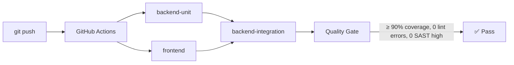

# Тестирование

## Быстрый запуск

### Бэкенд

```bash
# Все тесты (unit + integration + e2e)
docker compose run --rm test

# Только unit
docker compose run --rm test pytest tests/unit/ -v

# Конкретный файл
docker compose run --rm test pytest tests/unit/services/test_recommendation_service.py -v

# С coverage
docker compose run --rm test pytest --cov=app --cov-report=term-missing
```

### Фронтенд

```bash
cd frontend

# Все тесты
npm test -- --run

# С coverage
npm test -- --run --coverage

# Конкретный файл
npm test -- --run src/test/pages/PropertyDetails.test.tsx
```

## Структура тестов

### Бэкенд

```
backend/tests/
├── conftest.py               # Фикстуры: async session, test client, auth headers
├── test_geocoder.py          # Тесты геокодера
├── unit/                     # Unit-тесты (с моками)
│   ├── test_core.py
│   ├── test_models.py
│   ├── test_redis_client.py
│   ├── test_repositories.py
│   ├── test_units.py
│   └── services/
│       ├── test_auth_service.py
│       ├── test_image_service.py
│       ├── test_interactions_service.py
│       ├── test_property_service.py
│       └── test_recommendation_service.py
├── integration/              # Интеграционные тесты (реальная БД)
│   ├── test_auth.py
│   ├── test_auth_more.py
│   ├── test_contacts.py
│   ├── test_db.py
│   ├── test_properties.py
│   ├── test_properties_meta.py
│   ├── test_recommendations.py
│   ├── test_recommendations_more.py
│   ├── test_redis.py
│   ├── test_upload.py
│   ├── test_user_more.py
│   └── test_user_profile.py
└── e2e/                      # End-to-end тесты
    ├── test_e2e.py
    └── test_e2e_flow.py
```

### Фронтенд

```
frontend/src/test/
├── setup.ts                  # Настройка jsdom
├── services/
│   ├── auth.service.test.ts
│   ├── geocoder.test.ts
│   ├── properties.service.test.ts
│   ├── recommendations.service.test.ts
│   └── preferences.service.test.ts
├── store/
│   ├── authSlice.test.ts
│   └── authMiddleware.test.ts
├── pages/
│   ├── Home.test.tsx
│   ├── Map.test.tsx
│   ├── PropertyDetails.test.tsx
│   └── PropertyFormModal.test.tsx
├── components/
│   ├── Header.test.tsx
│   └── FilterPanel.test.tsx
└── features/
    └── PropertyForm.test.tsx
```

## Паттерны тестирования

### Unit-тест (мокаем БД)

```python
@pytest.mark.asyncio
async def test_find_similar_users_enough_likes(self, service):
    my_favs = [(MagicMock(id=str(i)), 0, 0) for i in range(4)]
    service.inter_repo.get_user_favorites = AsyncMock(return_value=my_favs)
    service.inter_repo.get_users_liked_properties = AsyncMock(
        return_value={"user-2": {"1", "2", "99"}}
    )
    result = await service._find_similar_users("user-1")
    assert "user-2" in result
```

### Интеграционный тест (реальная БД)

```python
@pytest.mark.asyncio
async def test_property_crud(async_client, auth_headers):
    response = await async_client.post(
        "/api/properties/", json=property_data, headers=auth_headers,
    )
    assert response.status_code == 201
    prop_id = response.json()["id"]

    response = await async_client.get(f"/api/properties/{prop_id}")
    assert response.status_code == 200

    response = await async_client.put(
        f"/api/properties/{prop_id}",
        json={"price": 15000000},
        headers=auth_headers,
    )
    assert response.status_code == 200

    response = await async_client.delete(
        f"/api/properties/{prop_id}", headers=auth_headers,
    )
    assert response.status_code == 204
```

### Компонентный тест (фронтенд)

```tsx
import { render, screen } from '@testing-library/react';

vi.mock('@shared/ui/Map', () => ({
  default: ({ children }: { children: React.ReactNode }) => (
    <div data-testid="yandex-map">{children}</div>
  ),
}));

describe('PropertyDetails', () => {
  it('should render property info', async () => {
    render(<PropertyDetails />);
    expect(await screen.findByText('Price')).toBeDefined();
  });
});
```

### Мокирование Redis

```python
@pytest.mark.asyncio
async def test_recommend_uses_cached_recs(self, service):
    import json
    cached_ids = json.dumps(["p1", "p2"])
    mock_redis = AsyncMock()
    mock_redis.get = AsyncMock(return_value=cached_ids)

    with patch(
        "app.services.recommendation_service.RedisClient.get_client",
        AsyncMock(return_value=mock_redis),
    ):
        result = await service.recommend("user-1", limit=5)
        assert service.prop_repo.get_by_ids.called
```

## Quality Gate

### Пороги coverage

| Метрика | Порог | Инструмент |
|---|---|---|
| Backend lines | ≥ 90% | pytest-cov |
| Frontend lines | ≥ 90% | vitest/istanbul |
| Frontend functions | ≥ 85% | vitest/istanbul |
| Frontend branches | ≥ 80% | vitest/istanbul |

### Ручная проверка перед коммитом

```bash
# Backend
cd backend && ruff check . && mypy . && bandit -c pyproject.toml -r app/ && pip-audit

# Frontend
cd frontend && npm run lint && npx tsc --noEmit && npm audit
```

### CI Pipeline



## Фикстуры

### conftest.py

| Фикстура | Область | Описание |
|---|---|---|
| `async_session` | function | Сессия БД с транзакцией и откатом |
| `async_client` | function | Async HTTP клиент (httpx) |
| `auth_headers` | function | Bearer token заголовки |
| `test_user` | function | Тестовый пользователь |

## Добавление нового теста

1. Определите тип: **Unit** (изолированный), **Integration** (с БД), **E2E** (сценарий)
2. Расположите файл в соответствующей директории
3. Следуйте именованию: `test_<название>.py` / `<название>.test.ts`
4. Убедитесь, что coverage ≥ 90%
